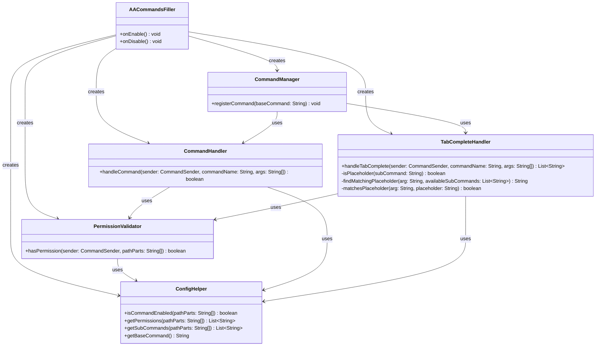

# AACommandsFiller

**A Minecraft server plugin that generates tab-completions for hierarchical command trees defined entirely in config.yml — with permission-based filtering so players only see what they're allowed to use.**


Built for the [TFMC](https://www.patreon.com/c/TFMCRP) roleplay server, where it runs in production filling tab-completions for commands handled by external event systems.

---

## What It Does

Define a command tree in YAML — nested subcommands, placeholders like `<number>` or `<playername>`, and optional permission nodes. The plugin registers the base command at runtime (no plugin.yml command entries needed) and serves smart, permission-filtered tab-completions for the whole tree.

| | |
|---|---|
| **Dynamic command registration** | The base command is registered via the server `CommandMap` at startup — nothing hardcoded |
| **Hierarchical command structures** | Arbitrarily nested subcommands, all defined in `config.yml` |
| **Permission-based filtering** | Completions only show to senders holding the required permission |
| **Smart placeholder matching** | `<number>`, `<playername>`, `<+/-><modifier>`, `<reason>`, and custom patterns |
| **Flexible permission system** | Single node or a list per command — OR logic, any one grants access |
| **Permission inheritance** | Nested paths fall back to the nearest parent's permission when they have none of their own |

## How It Works

1. **Config loading** — `ConfigHelper` reads the command tree and permission map from `config.yml`.
2. **Command registration** — `CommandManager` grabs the server `CommandMap` via reflection and registers the configured base command with execute/tab-complete delegates.
3. **Tab completion** — `TabCompleteHandler` walks the typed arguments, mapping literal input back onto placeholder nodes (e.g. `10` → `<number>`), then returns the next level of subcommands filtered by:
   - what exists in the config,
   - what the sender has permission to see,
   - what matches the current partial input.
4. **Validation** — `PermissionValidator` checks required permissions with OR logic; commands without a permission entry are public.

No listeners, no scheduled tasks — everything happens inside the command and tab-complete callbacks.

## Architecture

Small, deliberate footprint — each class has one job:

```
src/main/java/tfmc/justin/
├── AACommandsFiller.java              # Entry point: wiring, lifecycle
├── config/
│   └── ConfigHelper.java              # config.yml parsing: command tree, permissions, base command
├── handlers/
│   ├── CommandHandler.java            # Command execution: path + permission validation
│   └── TabCompleteHandler.java        # Completion filtering + placeholder matching
├── managers/
│   └── CommandManager.java            # Runtime command registration via CommandMap reflection
└── validators/
    └── PermissionValidator.java       # OR-logic permission checks
```



*Full diagram: [UML-Diagram.mmd](https://github.com/TF-Minecraft/AACommandsFiller/blob/83da4ab95f054667544e18ed9ee8cbcbf4f3d277/UML-Diagram.mmd)*

### Design decisions

- **Configuration over code** — the entire command tree, every placeholder, and every permission node are YAML edits, not releases.
- **Runtime registration over plugin.yml** — the base command name is itself config, so one build serves any server without touching the jar.
- **Completions only, execution elsewhere** — the plugin fills the tab-complete UI; actual command behavior stays with the event/command system that owns it.

## Installation

1. Drop `AACommandsFiller-2.1.jar` into your server's `plugins/` folder
2. Start or restart the server
3. Configure `plugins/AACommandsFiller/config.yml` as needed
4. Run `/aacommandsfiller reload` to apply config changes (requires `aacommandsfiller.admin`, default op)

### Requirements

| Dependency | Required |
|---|---|
| [Paper](https://papermc.io/) 1.21.10 (TFMC baseline) | Yes |
| Java | See the [shared baseline](../../PLATFORM.md); compiler release is 21 |

## Configuration

```yaml
# Base command name (e.g., tfmc will create /tfmc)
base-command: tfmc

# ========================================
# COMMANDS - Define your command structure
# ========================================
commands:
  # Simple command
  help: {}

  # Nested commands
  roll:
    strength: {}
    dexterity: {}
    <number>:
      <+/-><modifier>: {}

  # Staff commands
  ban:
    <playername>:
      <reason>: {}

# ========================================
# PERMISSIONS - Control who can see what
# ========================================
permissions:
  # Single permission
  ban: tfmc.staff

  # Multiple permissions (OR logic - player needs ANY)
  helper: [tfmc.helper, tfmc.admin]

  # Nested paths can be more restrictive than their parent
  helper.promote: tfmc.helper.senior
```

Commands without an entry in `permissions` are public. Nested paths without their own entry inherit the nearest parent's permission.

### Placeholder patterns

| Pattern | Matches | Example |
|---|---|---|
| `<number>`, `<amount>` | Any integer (positive or negative) | 10, -5, 100 |
| `<+/-><modifier>` or contains `modifier` | `+`/`-` followed by an integer | +5, -3, +12 |
| `<playername>`, `<player>`, `<name>` | Any non-empty text | Steve, Alex, Player123 |
| `<reason>`, `<message>`, `<text>` | Any non-empty text | Griefing, Spam, Hello |
| Any other `<custom>` placeholder | Any non-empty text | (default behavior) |

Matching is case-insensitive and keyword-based: if a placeholder name contains one of the keywords above (e.g. `<player_name>` contains "player"), it uses that pattern's rules.

## Example Use Cases

### Dice rolling system
```yaml
commands:
  roll:
    strength: {}
    dexterity: {}
    <number>:
      <+/-><modifier>: {}
```
- `/tfmc roll strength` → roll strength
- `/tfmc roll 10` → suggests `<+/-><modifier>`
- `/tfmc roll 10 +5` → roll d10 with +5 modifier

### Staff commands with permissions
```yaml
commands:
  ban:
    <playername>:
      <reason>: {}
  kick:
    <playername>: {}

permissions:
  ban: tfmc.staff
  kick: [tfmc.moderator, tfmc.admin]
```
- `/tfmc ban PlayerName Griefing` → visible to staff only
- `/tfmc kick PlayerName` → visible to mods or admins

## Building from Source

```bash
git clone https://github.com/TF-Minecraft/AACommandsFiller.git
cd AACommandsFiller
mvn clean verify
```

Use JDK 21 and Maven with the [shared baseline](../../PLATFORM.md). Paper API resolves from Maven; there are no external plugin dependencies. The artifact is written to `target/`.

## Source build metadata

- **Java 21** · **Paper API 1.21.10 (compile dependency)** · **Maven**
- Bukkit `CommandMap` reflection, command/tab-complete API, and YAML configuration API

## Author

**Justinas Launikonis** — [GitHub](https://github.com/JustinasLa) · [Support TFMC](https://www.patreon.com/c/TFMCRP)
