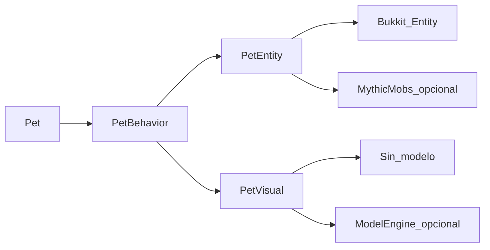

# Núcleo de la mascota

Documento vivo del diseño. Lo que acordemos después se añade aquí. El código implementa este núcleo; `PetBehavior` y `PetEntity` son nombres de diseño: en el código el movimiento está en `behavior/` y `runtime/`, y el cuerpo en `body/`.

Servidor objetivo: Paper 1.21. El seguimiento usa `Mob#getPathfinder()` (`moveTo`, `stopPathfinding`), que está en la API de Paper.

## Idea

La mascota es un objeto del plugin, con dueño, tipo y estado. La entidad de Minecraft es el cuerpo que está en el mundo en ese momento. MythicMobs y ModelEngine se usan solo si el servidor los tiene instalados. Un lobo, gato o zorro vanilla funciona en un servidor que solo tiene este plugin.

## Tres capas



### Pet

Identidad de la mascota. Guarda el identificador, el dueño, el tipo y el estado. Sigue existiendo cuando la entidad sale del mundo: el jugador se desconecta, cambia de mundo o el mob se descarga. El seguimiento y las interacciones no dependen de que el UUID de la entidad siga vivo.

Estados iniciales:

- `FOLLOWING`
- `SITTING`
- `PLAYING`
- `SLEEPING`

`PLAYING` y `SLEEPING` son estados de cuidado. Cómo come, juega, duerme, se ensucia y enferma está en [cuidado.md](cuidado.md).

### PetEntity

Cuerpo de la mascota. Sabe aparecer, moverse, pararse, teletransportarse y desaparecer. El núcleo solo habla con esta interfaz.

**Vanilla.** Spawnea un `EntityType` (`WOLF`, `CAT`, `FOX`, etc.). El movimiento usa el pathfinder de Paper. Si la entidad es `Sittable` o `Tameable`, el adaptador marca sentado o domesticado para que la pose vanilla coincida con el estado.

**MythicMobs.** Spawnea el mob por id (`getMythicMob(id)` y luego `spawn`) y recupera la entidad de Bukkit. Atributos, habilidades e IA de combate siguen definidos por el administrador en MythicMobs. Este plugin aplica la misma locomoción que a una entidad vanilla.

Si un tipo declara `mythic-mob` y MythicMobs no está instalado, ese tipo no se registra. El resto del plugin arranca igual.

### PetVisual

Reacciona a cambios de estado. No conoce bones ni geometría del modelo.

Sin ModelEngine, la implementación no hace nada: se ve la entidad vanilla.

Con ModelEngine, y si el tipo tiene un blueprint, este plugin lo aplica al crear el cuerpo y lo deja guardado en la entidad. Al cargar el chunk, ModelEngine lo monta otra vez. Si MythicMobs ya lo puso, el hook no crea otro: busca el `ModeledEntity` existente y llama a `playAnimation` con el nombre del estado (`FOLLOWING` → `walk`, `SITTING` → `sit`). El detalle está en [gestion.md](gestion.md).

## Quién mueve a la mascota

El comportamiento de mascota es de este plugin. En cada tick, `PetBehavior` mira el estado y habla con la entidad y con la representación:

| Estado | Entidad | Visual |
| --- | --- | --- |
| `FOLLOWING` | Camina hacia el dueño. Si la distancia pasa un umbral, se teletransporta. | Animación de seguimiento, si existe |
| `SITTING` | Para el pathfinder y, si puede, se sienta | Animación de sentarse, si existe |
| `PLAYING` | Se queda junto al dueño y juega unos segundos | Animación de juego, si existe |
| `SLEEPING` | Se echa y recupera energía | Animación de dormir, si existe |

En un mob de MythicMobs pensado como mascota, los goals de vagar o de seguir se dejan vacíos. Esas locomociones y el pathfinder de Paper escriben el mismo movimiento y se pisan. Las skills de MythicMobs se mantienen: atributos, habilidades por timer, señal o interacción.

## Integraciones opcionales

`plugin.yml` las declara como `softdepend: [MythicMobs, ModelEngine, ItemsAdder, MMOItems]`.

Al arrancar, el plugin comprueba si ModelEngine está activo y elige `ModelHook` o `IdleVisual` como `PetVisual`. Los adaptadores de `integration/` (`MythicSpawn` y `ModelHook`) llaman a MythicMobs y ModelEngine por reflexión, así que no hace falta tenerlos para compilar ni para arrancar.

## Configuración de tipos

```yaml
pets:
  wolf:
    entity: WOLF
  blaze_buddy:
    mythic-mob: BlazeBuddy
    animations:
      FOLLOWING: walk
      SITTING: sit
      PLAYING: play
      SLEEPING: sleep
```

`wolf` funciona solo con este plugin. `blaze_buddy` exige MythicMobs. Las animaciones se usan si además está ModelEngine y el mob lleva ese modelo.

## Relacionado

- [cuidado.md](cuidado.md): hambre, ánimo, energía, limpieza, enfermedad y cómo la atiende el jugador.
- [entrenamiento.md](entrenamiento.md): trucos, la palabra que elige el dueño y cómo se enseñan con paciencia.
- [juego.md](juego.md): el juego corto, lanzar un juguete y el favorito sorteado de cada mascota.
- [gestion.md](gestion.md): huevo, caseta, silbato, cupos y cuándo corren las necesidades.

## Fuera de este núcleo

Aún no está diseñado:

- Comandos y permisos propios de este plugin, aparte del permiso de crafteo que resuelve el sistema de profesiones
- Qué pasa si el cuerpo muere por el mundo (lava, caída, un mob)
