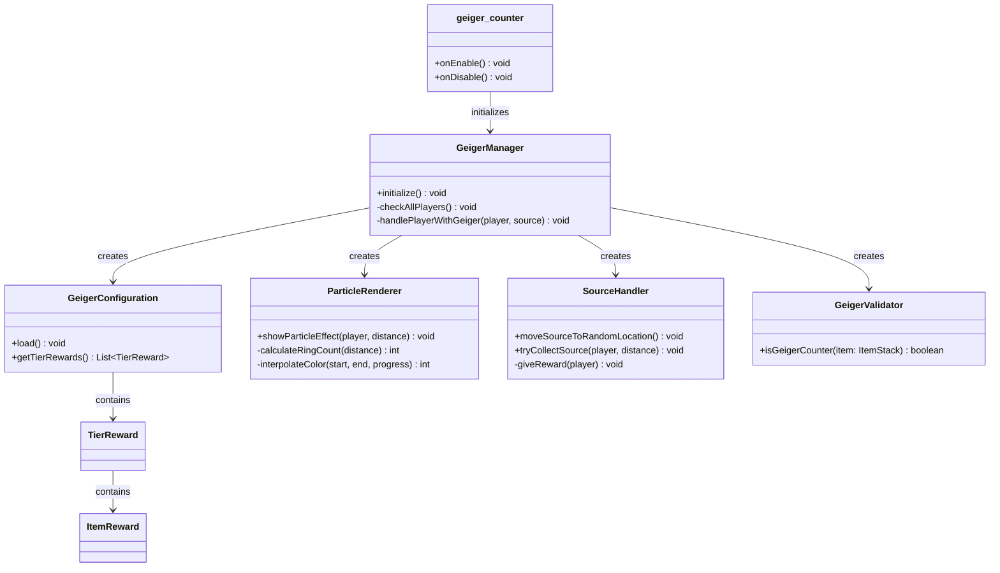

# GeigerCounter

**A Minecraft server plugin that turns exploration into a treasure hunt — track a hidden radioactive source by particle signal and claim tiered loot.**


Built for the [TFMC](https://www.patreon.com/c/TFMCRP) roleplay server, where it runs in production as a server-wide scavenger-hunt event mechanic.

---

## What It Does

Hold a **Geiger Counter** item and the world starts talking back: particle rings around you shift in color and count based on how close you are to a hidden radioactive source. Walk it down, collect the source, and a weighted loot table decides your prize — anywhere from common food to mythical skin scrolls. The counter burns out, the source relocates, and the hunt begins again.

| | |
|---|---|
| **Signal tracking** | Particle rings guide players toward a randomly placed source — more rings and brighter colors mean closer |
| **Tiered rewards** | 6 rarity levels (Common → Mythical) with fully weighted drop chances |
| **Self-resetting hunt** | Collecting the source relocates it to a new random spot in the search area |
| **Consumable gameplay** | The Geiger Counter "runs out of charge" on success, becoming a **Dead Geiger Counter** |
| **Geiger clicking** | The counter clicks faster the closer the source gets — audible signal, not just visual |
| **Per-player drop limits** | A player may claim at most *x* drops per *y* time window, so loot stays scarce |
| **Config-driven design** | Search area, detection ranges, particle colors, and reward pools all live in `config.yml` |

## How It Works

A repeating task checks every online player. For each player holding a Geiger Counter:

1. The horizontal distance to the radioactive source is calculated (Y is ignored, so the signal works across terrain height).
2. That distance is mapped to a particle configuration — ring count (1–3) from distance thresholds, and a color interpolated along a two-stage gradient (dark purple → purple far away, purple → white up close).
3. The rings spawn around the player as a live "signal strength" readout.
4. Within collection distance (20 blocks by default), the source is collected automatically: a tier is rolled by weight, a random item from that tier is granted, the counter is swapped for its dead version, and the source moves to a fresh random location.

### Sound

The counter clicks. Distance controls the click **rate**, not the pitch — that is what a real Geiger–Müller tube does, and it keeps the audio readable as a signal on its own. Clicks are rolled per tick against a probability rather than fired on a fixed interval, so their spacing is irregular the way decay events are; evenly spaced clicks just sound like a metronome.

Default is `block.note_block.hat` at 0.5 clicks/sec on the edge of detection range, ramping to 18/sec at the source. Only the holder hears it. Any sound event ID works — preview them at [minecraftsounds.com](https://minecraftsounds.com).

### Drop limits

`limits` caps how often a single player may claim the source: `drops` collections per `time` window. The window slides — each collection frees up again exactly `time` after it happened, so `drops: 3` with `time: 12h` works out to 6 per day.

Collection stamps are stored in `plugins/geiger_counter/drop-limits.yml`, so a restart cannot be used to wipe the limit. A limited player still tracks and sees the signal, but collecting does nothing: the source stays where it is, so somebody else can still claim it, and the player is told when their next slot opens.

Players with `geiger.limit.bypass` are never limited.

### Commands

| Command | Description |
|---|---|
| `/geiger locate` | Print the current source coordinates |
| `/geiger move [x z]` | Move the source to a random spot, or to specific coordinates (coords tab-complete to your position and the area corners) |
| `/geiger limits <player>` | Show the player's remaining drops and time until the next one |
| `/geiger resetlimits <player>` | Clear the player's drop history |
| `/geiger droplist [name]` | Show available lists, or switch and save the active list |
| `/geiger reload` | Reload `config.yml` |

| Permission | Default | Grants |
|---|---|---|
| `geiger.admin` | op | Access to `/geiger` |
| `geiger.limit.bypass` | op | Exemption from the per-player drop limit |

## Architecture

Small, deliberate footprint — each class has one job:

```
src/main/java/tfmc/justin/
├── geiger_counter.java                # Entry point: wiring, lifecycle
├── config/
│   ├── ConfigMigrator.java            # Adds new keys to existing configs, splits out messages.yml
│   ├── Messages.java                   # messages.yml lookup + placeholder filling
│   └── GeigerConfiguration.java       # config.yml loading: area, ranges, colors, rewards
├── handlers/
│   ├── GeigerClickPlayer.java         # Distance → click rate, rolled per tick
│   ├── ParticleRenderer.java          # Distance → ring count + color gradient rendering
│   └── SourceHandler.java             # Source placement, collection, reward rolls
├── hooks/
│   └── WorldGuardHook.java            # Optional WorldGuard region lookups
├── managers/
│   ├── GeigerManager.java             # Periodic player checks, component coordination
│   └── DropLimitManager.java          # Per-player drop limits + on-disk history
├── models/
│   ├── TierReward.java                # Reward tier: weight + item pool
│   └── ItemReward.java                # Single reward: item path + amount
├── utils/
│   └── Utils.java                     # Shared helpers
└── validators/
    ├── GeigerValidator.java           # Is this item a Geiger Counter? (TLibs paths)
    └── SpawnLocationFilter.java       # Is this a legal spot for the source?
```



*Full diagram: [UML-Diagram.mmd](https://github.com/TF-Minecraft/geiger-counters/blob/fd1420862ebaa7da7905d88ce1cd731e9c23f0f8/UML-Diagram.mmd)*

### Design decisions

- **Configuration over code** — the entire hunt is data: search area, thresholds, gradient colors, messages, and every reward pool are YAML edits, not releases.
- **One scheduler task, not per-player listeners** — a single periodic check scans players and short-circuits for anyone not holding a counter, keeping the hot path cheap.
- **Abstraction over item plugins** — items and rewards resolve through the TLibs `ItemAPI`, so one config format covers MMOItems, ItemsAdder, and vanilla items with a one-character prefix.

## Installation

1. Drop `geiger_counter-1.1.3.jar` into your server's `plugins/` folder
2. Install **TLibs** (required). **MMOItems** / **ItemsAdder** are optional item sources
3. Restart the server
4. Configure `plugins/geiger_counter/config.yml` and `messages.yml` — the source spawns at a random location within the configured area

### Requirements

| Dependency | Required |
|---|---|
| [Paper](https://papermc.io/) 1.21.10 (TFMC baseline) | Yes |
| Java | See the [shared baseline](../../PLATFORM.md); compiler release is 21 |
| [TLibs](https://www.spigotmc.org/resources/tlibs.127713/) | Yes |
| [MMOItems](https://www.spigotmc.org/resources/mmoitems-premium.39267/) | Optional |
| [ItemsAdder](https://itemsadder.com/) | Optional |
| [WorldGuard](https://enginehub.org/worldguard) 7.0+ | Optional — needed only for the region blacklist |

## Usage

1. Obtain a **Geiger Counter** item (via TLibs/MMOItems/ItemsAdder)
2. Hold it — particle rings appear, showing signal strength
3. Follow the signal: more rings and lighter colors mean you're getting closer
4. Get within **20 blocks** (default) to collect the source automatically
5. Receive a reward rolled from the tiered loot pool; the counter becomes a **Dead Geiger Counter** and the source relocates

### Reading the signal

| Signal | Meaning |
|---|---|
| **3 rings** | Within 100 blocks — very close |
| **2 rings** | Within 300 blocks — close |
| **1 ring** | Beyond 300 blocks — far |
| **White** | Very close (0–200 blocks) |
| **Purple → dark purple** | Far away (200–2500 blocks) |
| **Fast clicking** | Rate rises from 0.5/sec at the edge of range to 18/sec at the source |

## Configuration

```yaml
# Source location settings
source:
  world: world            # World where source spawns
  top-left:               # Search area corner 1
    x: -1000.0
    z: -1000.0
  bottom-right:           # Search area corner 2
    x: 1000.0
    z: 1000.0
  spawn-filters:                    # Where the source may NOT spawn
    max-attempts: 50                # Re-rolls (async chunk loads) before falling back
    reject-liquid: true             # No water / lava / waterlogged ground
    reject-void: true               # No empty columns
    blocked-blocks: []              # Extra banned ground materials, e.g. MAGMA_BLOCK
    min-distance-from-spawn: 250.0  # Horizontal blocks from world spawn (0 = off)
    worldguard:
      enabled: true
      blacklisted-regions: []       # Region IDs the source may not spawn inside

# Detection settings
detection:
  collection-distance: 20.0           # Distance to collect source (blocks)
  max-detection-distance: 2500.0      # Maximum detection range
  close-range-threshold: 200.0        # Distance threshold for color shift
  ring-thresholds:
    three-rings: 100.0    # 3 rings when closer than this
    two-rings: 300.0      # 2 rings when closer than this (else 1)

# Geiger clicking sound
sound:
  enabled: true
  sound: block.note_block.hat   # Any sound event ID
  volume: 0.35
  pitch: 1.7
  pitch-variance: 0.15          # Jitter so repeats do not sound looped
  min-rate: 0.5                 # Clicks/sec at max detection distance
  max-rate: 18.0                # Clicks/sec at the source (20 = one per tick)
  curve: 2.0                    # Higher = ramps up harder near the source

# Per-player drop limits
limits:
  enabled: true
  drops: 3      # Max collections per window
  time: 12h     # Window length - accepts s, m, h, d

# Particle effect colors (RGB: 0-255)
colors:
  close-range:
    start: { red: 255, green: 255, blue: 255 }  # White (closest)
    end: { red: 255, green: 0, blue: 255 }      # Purple (threshold)
  far-range:
    start: { red: 255, green: 0, blue: 255 }    # Purple (threshold)
    end: { red: 17, green: 0, blue: 17 }        # Dark Purple (farthest)

# Reward tiers with weighted chances
drops:
  tier-weights:
    common: 45      # 45%
    uncommon: 30    # 30%
    rare: 15        # 15%
    epic: 7         # 7%
    legendary: 2.5  # 2.5%
    mythical: 0.5   # 0.5%

  active-list: default
  lists:
    default:
      tiers:
        common:
          - "m.FOODS.SAUSAGE:32"
          - "v.raw_iron_block:32"
          - "ia.tfmc:mythril_ingot"
        # ... (see config.yml for full reward lists)

```

Named reward pools live under `drops.lists.<name>.tiers`. `/geiger droplist <name>` saves `drops.active-list` and reloads the configuration.

All chat text lives in a separate **`messages.yml`**, split into what players see and what only `/geiger` operators see:

```yaml
# PLAYER - seen by anyone hunting the source
player:
  found-source: "&#AA00FFYou have found the source of Arcane Radiation! ..."
  dead-geiger: "&7Your Arcane Trace Detector has run out of fuel."
  limit-reached: "&cYou have already collected %max% sources in %window%. Try again in %time%."

# ADMIN - only ever seen by whoever runs /geiger
admin:
  usage: "&eUsage: /geiger <locate|move [x z]|...>"
  source-located: "&aRadioactive source is at X = %x% Z = %z% (world: %world%)"
  move-success: "&aRadioactive source moved to X = %x% Z = %z%"
  limits-status: "&a%player% has %remaining%/%max% drops left per %window%."
  # ... 12 more, each documenting its own placeholders
```

Console log lines stay hardcoded in English, so logs and bug reports remain readable whatever this file is translated to.

Upgrading? Messages are migrated automatically — out of `config.yml` and into the `player:`/`admin:` split, customisations preserved. `config-version` in `config.yml` tracks which migrations have run.

**Item path formats**

| Source | Format | Example |
|---|---|---|
| MMOItems | `m.category.item_id` | `m.FOODS.SAUSAGE` |
| ItemsAdder | `ia.namespace:item_id` | `ia.tfmc:mythril_ingot` |
| Vanilla | `v.material` | `v.raw_iron_block` |

**Reward tiers**

| Tier | Weight | Typical Rewards |
|---|---|---|
| **Common** | 45% | Food, basic materials, raw iron |
| **Uncommon** | 30% | Rare fragments, repair kits, research items |
| **Rare** | 15% | Advanced fragments, medium repair kits |
| **Epic** | 7% | Runestones, trial keys, strong repair kits |
| **Legendary** | 2.5% | Legendary materials, magic repair kits, gemstone pouches |
| **Mythical** | 0.5% | Item skin scrolls, mythical pouches, rare currency |

## Building from Source

```bash
git clone https://github.com/TF-Minecraft/TLibs.git tlibs
git clone https://github.com/TF-Minecraft/geiger-counters.git
cd geiger-counters
python3 ../tlibs/tools/install-dependency.py --pom pom.xml
mvn clean verify
```

Use JDK 21, Maven and Python 3. The shared installer verifies the pinned release checksum; see [TLibs dependency setup](../TLibs/README.md). Install the matching `me.plugins:tlibs:1.1.0` artifact as described in the [shared baseline](../../PLATFORM.md), then run `mvn clean verify`. Paper API, WorldGuard API and bStats resolve from Maven; MMOItems is not a direct build dependency. The artifact is written to `target/`.

## Source build metadata

- **Java 21** · **Paper API 1.21.10 (compile dependency)** · **Maven**
- Bukkit event system, scheduler, and YAML configuration API
- TLibs ItemAPI for cross-plugin item resolution

## Author

**Justinas Launikonis** — [GitHub](https://github.com/JustinasLa) · [Support TFMC](https://www.patreon.com/c/TFMCRP)
