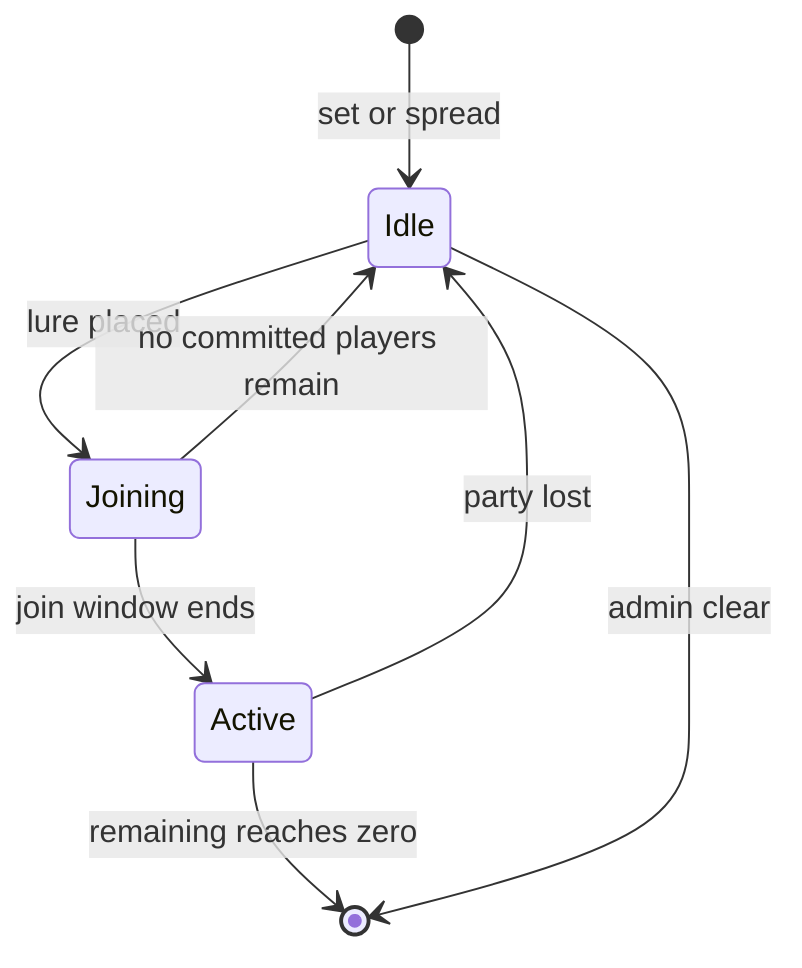

# Behaviour, configuration, and operations

[Infestations documentation](README.md) · [All projects](../../README.md)

## System model

An infestation belongs to one SimpleFactions province and has a mob group from
`groups.yml` and a severity: `mild`, `worrying`, `severe`, or `extreme`. Each
province holds at most one infestation. Only land provinces can be infested:
provinces with a terrain listed in `skip-terrains` are refused, and a group
with a `terrains` list is limited to those terrains.

**Idle.** Every `ambient-interval-ticks`, each player in Survival or Adventure
inside an idle infested province triggers one spawn attempt, as long as the
province's tagged ambient mobs are below `ambient-cap`. Spots lie in a ring
between `ambient-ring-min` and `ambient-ring-max` blocks from the player, within
two blocks of the player's height, inside the same province, and at or above
the group's `min-y`. Each spot needs a clear 3×3×3 space over a solid 3×3
floor in loaded chunks. No spot may be within `min-player-distance` of any
player other than spectators, checked again when the delayed spawn fires; the
ring minimum is raised to that distance and the ring maximum to at least eight
blocks beyond it. The search tries a capped number of random points, so a
failed search logs `no-spot` without loading chunks. `night-only` groups spawn
only while world time is 13000–22999. Mobs are picked from the group's weighted
MythicMobs list and tagged with the province and kind. Mobs that a dying
tagged mob summons, such as parasitic worms, take its tags. Killing ambient
mobs never clears an infestation, and the plugin does not remove spawned mobs.
The loaded ambient count is recounted at most every five seconds after tagged
mobs load or unload.

**Lure.** Placing InteractibleFurniture whose item path equals `lure-item`
starts a lure. Placement is cancelled unless the province is infested land with
no lure; placing the lure item as an ordinary block is always cancelled. The
placer joins automatically and other players in the province are notified.
During the `join-seconds` window, players in the province see an action-bar
countdown and join by right-clicking the lure. Ambient spawning stops for the
duration of the lure; existing ambient mobs stay.

When the window ends, the province's loaded ambient mobs become lure mobs and
count toward `lure-count`. The remaining count starts at `lure-count`, or at
the number of mobs taken over if that is larger. It is the number of mobs left
to kill: any death of a lure-tagged mob reduces it, and each mob summoned by a
dying lure mob (for example the parasitic worms a bug zombie leaves) is tagged
and adds one to it. The lure spawns mobs until everything left to kill is in
the field, paced evenly across `lure-duration-seconds`, between
`min-player-distance` (at least 4) and `lure-spawn-radius` blocks from the lure
and never within `min-player-distance` of a player. The duration paces
spawning; it is not a time limit. Every five seconds the lure recounts its
loaded mobs, takes over ambient mobs that loaded since, and replaces mobs that
were lost without being killed. A floating text display above the lure shows
the countdown or the remaining count to players within `hologram-view-range`. Right-clicking an active lure makes the remaining lure mobs
glow for 10 seconds and commits a player who has not yet joined. Uncommitted
Survival and Adventure players in the province take `deserter-damage` every
second until they leave.

- **Victory:** two seconds after the remaining count reaches zero, if it is
  still zero, the lure is removed and the infestation is cleared. The delay lets
  death summons join the count.
- **Failure:** the lure is removed and the infestation returns to idle at the
  same severity when no committed player is alive, online, or within the logout
  grace period. A committed player who leaves the province stays in the lure and
  takes `deserter-damage` every second, in Survival or Adventure, until
  `/lure leave` drops them out. Coming back into the province stops that damage
  without dropping them. `/lure leave` fails the lure when nobody committed
  remains.
- **Logout:** a committed player who logs out has `logout-grace-seconds` to
  return and remains committed. After the grace period, they are killed on
  their next login. A committed player who dies leaves the lure.

Players cannot break the lure, and explosions and pistons cannot move it. Lure
furniture that does not match saved lure state is removed on enable, reload,
chunk load, or when a player touches it.

**Spread.** When `spread` is `true`, every `spread-interval-seconds` each idle
infestation rolls `worsen-chance` to rise one severity (up to `extreme`). It
then considers uninfested land neighbours its group may occupy, plus such land
on the far side of one adjacent `water` or `sea` province. Two-province hops are
not considered. Each candidate uses its easiest route (land, then water, then
sea); one candidate is chosen, weighted by route chance, and a single roll
against `spread-chance-<route>` for the source severity decides whether it
becomes a new `mild` infestation of the same group. Infestations with a lure
neither worsen nor spread.

## Configuration files

The plugin copies its defaults into `plugins/Infestations/` on first start.

| File | Purpose |
| --- | --- |
| `config.yml` | Debug and spawn-log switches, spread switch, interval and chances, lure item, join window, lure spawn radius, minimum spawn distance from players, logout grace, deserter damage, hologram range, and `skip-terrains`. |
| `groups.yml` | Mob groups: `display` name, `night-only`, optional `min-y`, optional SimpleFactions `terrains`, weighted MythicMobs `mobs`, and per-severity `ambient-cap`, `ambient-interval-ticks`, `ambient-ring-min`, `ambient-ring-max`, `lure-count`, and `lure-duration-seconds`. |
| `messages.yml` | Chat, action-bar, and hologram text. `{prefix}` inserts the `prefix` entry; hex colours are formatted through TLibs. |

Chances are values from 0 to 1. Groups without `mobs` are skipped with a
warning, unknown terrain names are reported but kept, and omitted severity rows
use built-in defaults. The default `swamp_mobs` group spawns `SwampGhoul` at
night in `bog` provinces.

## Commands and permissions

Admin commands use `/infestation` (alias `/infestations`). Province arguments
take a numeric SimpleFactions province ID or `here` for the player's province.
`/lure leave` is available to every player.

| Command | Permission | Effect |
| --- | --- | --- |
| `/infestation set <province\|here> <group> <severity>` | `infestations.admin` | Infest an uninfested land province that the group's terrain rules allow. |
| `/infestation clear <province\|here>` | `infestations.admin` | Remove an infestation and any lure it has. |
| `/infestation list` | `infestations.admin` | List infestations by province, group, and severity, marking those with a lure. |
| `/infestation reload` | `infestations.admin.reload` | Reload all three files, then reload saved state from disk. |
| `/lure leave` | none | Drop the player out of every lure they have joined. |

Both permissions default to operators, and `infestations.admin` grants
`infestations.admin.reload`. Because `plugin.yml` also requires
`infestations.admin` for the command itself, the reload permission alone is not
enough. Reloading re-reads `Data/infestations.json`, removes stray lure
furniture and text displays, recounts loaded ambient mobs, and re-exports the
map data.

## Integrations

- **SimpleFactions** supplies province lookups, terrain, neighbours, and the
  province enter and leave events that govern lure commitment.
- **MythicMobs** spawns every ambient and lure mob. Unknown mob IDs are logged
  and skipped.
- **InteractibleFurniture** hosts the lure; placement, interaction, and break
  events drive the lure lifecycle. TLibs item paths identify the lure item.
- **Map export:** on start and whenever infestations are set, spread, cleared,
  or reloaded, the plugin writes each province's ID, severity, group, and
  display name to `MapAPI/infestation_data.json` and uploads it through the
  SimpleFactions REST server as `infestation_data`.

## Persistence and shutdown

- Infestations and lure state, including committed players, logout grace, and
  lure counters, are stored in `plugins/Infestations/Data/infestations.json`.
- The latest map export is `plugins/Infestations/MapAPI/infestation_data.json`.
- When `logging` is true, spawn decisions are appended to
  `plugins/Infestations/logs/spawn.log`; `wipe-log` deletes it on each start
  and reload.

State is saved after each change and every five seconds. On a normal disable,
the plugin removes lure text displays and saves state. Lure timers use
wall-clock time, so a join window that expired during downtime activates immediately.
Stop the server before editing the data file, since periodic saves overwrite
manual changes.

## Validation

For a server-side change, verify the following on Paper 1.21.10 with the pinned
dependency set:

1. Start with both an empty data directory and a copy of representative
   infestation data, and confirm the configs load without group or terrain
   warnings and every configured MythicMobs ID exists.
2. Set, list, and clear infestations with both a province ID and `here`, and
   confirm refusals for water or sea, disallowed terrain, and provinces that
   are already infested.
3. Confirm ambient mobs spawn in the configured ring inside the province, never
   within `min-player-distance` of a player, stop at the cap, and honour
   `night-only` and `min-y`.
4. Place lures with and without an infestation, then exercise joining, the
   countdown, activation, paced spawning, highlighting, and deserter damage.
   Confirm roaming ambient mobs count toward the lure when it activates, and
   that killing a mob that summons parasitic worms raises the remaining count.
5. Exercise victory, a committed player leaving the province (damage until
   `/lure leave`), losing the whole party, and a logout both within and beyond
   the grace period.
6. On a test server, enable `spread` with a short interval and confirm
   worsening, land spread, single water and sea hops, and group terrain limits.
7. Confirm `MapAPI/infestation_data.json` is written and uploaded.
8. Reload and restart cleanly during a lure, and confirm infestations, the lure,
   its text display, and its counters are restored without duplicates.
