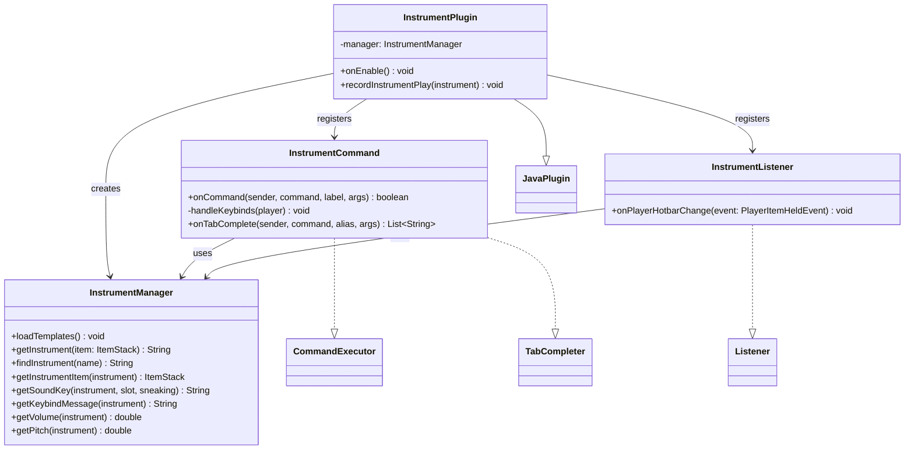

# MusicalInstruments

**A Minecraft server plugin that turns items into playable musical instruments — play live music with your hotbar.**


Built for the [TFMC](https://www.patreon.com/c/TFMCRP) roleplay server, where it runs in production for live in-game concerts and performances.

---

## What It Does

Hold an instrument in your off-hand and your hotbar becomes a keyboard: switching to slots 1–8 plays notes in real time, and holding **Shift** plays alternate notes or full chords. Each instrument is fully data-driven — server admins define instruments, sounds, volume, and pitch entirely in YAML, with no code changes required.

| | |
|---|---|
| **Live performance** | Hotbar slots 1–8 mapped to notes; instant playback with note particle effects |
| **Chord modifier** | Shift + slot plays an alternate note or chord per instrument |
| **Custom sound packs** | Integrates with MMOItems, ItemsAdder and Nexo resource-pack sounds, plus vanilla sounds |
| **Config-driven design** | New instruments added purely through `config.yml` — items, keybinds, sounds, volume, pitch |
| **In-game help** | `/instruments keybinds` shows the note layout for whatever instrument you're holding |

## How It Works

The plugin listens for `PlayerItemHeldEvent` (hotbar slot changes). When the player has a configured instrument in their off-hand:

1. The new slot number and sneak state are resolved to a sound key via the instrument's config mapping (e.g. slot `3` + sneak → `instruments.accordion_3e_chord`).
2. The sound plays at the player's location in the `RECORDS` sound category, using the instrument's configured volume (1.0 = 16 blocks of audible range) and pitch.
3. A note particle spawns above the player, and the held slot resets to slot 9 — so the same note can be triggered repeatedly without dead inputs. The slot change itself is cancelled, which keeps the server on slot 9 as well as the client; Paper ignores a key press for the slot the server already has selected, so otherwise a repeated note would be dropped.

Slot changes that another plugin has already cancelled are ignored. Keys without a configured sound (such as slot 9) change slot normally.

## Architecture

Small, deliberate footprint — each class has one job:

```
src/main/java/net/tfminecraft/musicalinstruments/
├── InstrumentPlugin.java              # Entry point: wiring, lifecycle, config loading
├── commands/
│   └── InstrumentCommand.java         # /instruments command + tab completion
├── events/
│   └── InstrumentPlayEvent.java       # Public event fired for each played note
├── items/
│   └── ItemResolver.java              # Vanilla and optional plugin item resolution
├── listeners/
│   └── InstrumentListener.java        # Hotbar-change → sound playback pipeline
├── managers/
│   └── InstrumentManager.java         # Config-backed instrument/sound resolution
└── util/
    └── LegacyModelData.java           # Integer custom model data for modeled(...) items
```



### Design decisions

- **Configuration over code** — instruments are pure data. Adding a new instrument (item, note layout, chords, volume) is a YAML edit, not a release.
- **Event-driven, zero polling** — playback rides on Bukkit's own hotbar event. The only scheduled work is a one-off task on the first tick that resolves instrument items after the item plugins have enabled.
- **Abstraction over item plugins** — item identity resolves through a built-in `ItemResolver`, so the same config format supports MMOItems, ItemsAdder, Nexo, and vanilla items with a short prefix. The item plugins are reached reflectively, so none is a hard dependency and no third-party library plugin is needed.

## Installation

1. Drop the release JAR into your server's `plugins/` folder
2. No library plugin is required. **MMOItems** / **ItemsAdder** / **Nexo** are optional — install them only if your config references `m.`, `ia.` or `nx.` item paths
3. Restart the server
4. Define your instruments in `plugins/MusicalInstruments/config.yml`

### Requirements

| Dependency | Required |
|---|---|
| [Paper](https://papermc.io/) 1.21.10 | TFMC runtime target |
| Java | Follow the [shared runtime and build baseline](../../PLATFORM.md); this plugin targets Java 21 bytecode |
| [MMOItems](https://www.spigotmc.org/resources/mmoitems-premium.39267/) | Optional — only for `m.` item paths |
| [ItemsAdder](https://itemsadder.com/) | Optional — only for `ia.` item paths |
| [Nexo](https://polymart.org/resource/nexo.6901) | Optional — only for `nx.` item paths |

## Usage

1. Hold an instrument item in your **off-hand**
2. Switch between hotbar slots **1–8** to play notes
3. Hold **Shift** while switching to play chords / alternate notes
4. Run `/instruments keybinds` to see your instrument's note layout

| Command | Description | Permission |
|---|---|---|
| `/instruments keybinds` | Show the keybind layout for the instrument in your off-hand | `instruments.use` (default: everyone) |
| `/instruments list` | List all loaded instruments | `instruments.use` (default: everyone) |
| `/instruments give <instrument>` | Give yourself an instrument item. The name is not case-sensitive; if your inventory is full, the item drops at your feet | `instruments.give` (default: op) |
| `/instruments reload` | Reload the config and instrument cache | `instruments.reload` (default: op) |

## Configuration

Each instrument is one self-contained section in `config.yml`:

```yaml
accordion:
  # Item that acts as the instrument (MMOItems/ItemsAdder/Nexo/vanilla path)
  item: "m.instruments.accordion"

  # Message shown by /instruments keybinds
  keybind-message: |
   §aUse keys 1-8 to play §6notes:
   §e1-[C] 2-[D] 3-[E] 4-[F] 5-[G] 6-[A] 7-[B] 8-[C]

   §aHold shift to play §6chords:
   §e1-[C] 2-[D] 3-[E] 4-[F] 5-[G] 6-[A] 7-[B] 8-[C]

  # Hotbar slot → sound key (plus shift variants)
  hotbar-sounds:
    1: instruments.accordion_1c_single
    1+sneak: instruments.accordion_1c_chord
    2: instruments.accordion_2d_single
    2+sneak: instruments.accordion_2d_chord
    # ... slots 3-8 follow the same pattern

    volume: 4.0   # 1.0 = 16 blocks of range (4.0 = 64 blocks)
    pitch: 1.0    # 0.5 (lower/slower) to 2.0 (higher/faster)
```

**Item path formats**

| Source | Format | Example |
|---|---|---|
| MMOItems | `m.category.item_id` | `m.instruments.accordion` |
| ItemsAdder | `ia.namespace:item_id` | `ia.tfmc:accordion` |
| Nexo | `nx.item_id` | `nx.accordion` |
| Vanilla | `v.material` | `v.iron_ingot` or `v.minecraft:iron_ingot` |
| Vanilla + model | `modeled(type=..;name=..;model=..)` | `modeled(type=paper;name=&6Flute;model=1001)` |

An instrument whose item cannot be resolved, or resolves to air, is skipped with a warning in the server log.

## Building from Source

```bash
git clone https://github.com/TF-Minecraft/MusicalInstruments.git musical-instruments
cd musical-instruments
mvn clean verify
```

Use Maven and JDK 21, following the [shared baseline](../../PLATFORM.md). The compiler release is 21 and all dependencies resolve from public repositories. The artifact is written to `target/`.

`verify` runs the unit tests (JUnit 5, MockBukkit and Mockito) and fails unless JaCoCo reports 100% instruction and branch coverage. The coverage report is written to `target/site/jacoco/index.html`. The tests replace MMOItems, ItemsAdder and Nexo with small stand-in classes under `src/test/java`, which have those plugins' package names. MockBukkit does not implement custom model data components, so model data for `modeled(...)` items is only covered with mocks.

## Metrics

This plugin collects anonymous usage statistics via [bStats](https://bstats.org/plugin/bukkit/musicalinstruments/33322): server count, player count, server software and version, Java version, and plugin-specific counters (instruments loaded, notes played per instrument). No player names, IPs, or world data are sent.

To opt out, set `enabled: false` in `plugins/bStats/config.yml`. That disables bStats for every plugin on the server.

## Tech Stack

- **Java 21 bytecode target** · **Paper API 1.21.10 build dependency** · **Maven**
- TFMC runtime target: **Minecraft 1.21.10**. Build and loader metadata also target 1.21.10; validate releases against the [shared baseline](../../PLATFORM.md).
- Bukkit event system, scheduler, and YAML configuration API
- Reflective MMOItems / ItemsAdder / Nexo lookups for cross-plugin item resolution (no hard dependency)
- bStats for anonymous usage metrics

## License

Released under the [Artistic License 2.0](https://github.com/TF-Minecraft/MusicalInstruments/blob/main/LICENSE).

## Author

**Justinas Launikonis** — [GitHub](https://github.com/JustinasLa) · [Support TFMC](https://www.patreon.com/c/TFMCRP)
