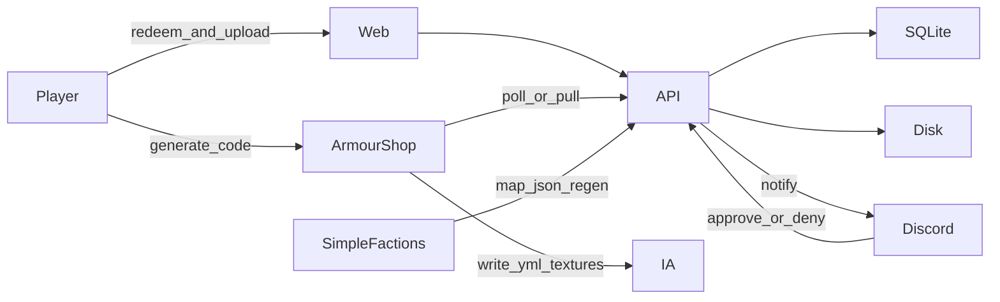

# Architecture

End-state shape of the **TFMC platform**: modular website hub plus SimpleFactions (map), ArmourShop/ItemsAdder (skins), DrinkBuilder (drinks), and tfmc_bot (Discord).

Component journeys: [flows/journeys.md](flows/journeys.md). Dev-only flags: [ops/dev-config.md](ops/dev-config.md).

## Current stack (`dev` branch)

| Layer | Tech |
|-------|------|
| Frontend | Next.js (App Router), React, Tailwind - production Docker (`npm run start`) |
| Backend | FastAPI + Uvicorn, Pillow mapgen, SQLite (skins, drinks, characters, identity) |
| Deploy | `docker-compose.yml` - backend `:8000`, frontend `:3000` |
| Data | Per-map folders under `input/`, `defines/`, generated `output/`; `backend/src/data/` for app DB + uploads |

```text
SimpleFactions (plugin)
        │  POST queue / upload JSON, GET regenerate
        ▼
FastAPI ── mapgen/regiongen ──► backend/src/output/{map}/…
        │  skins / drinks / characters / identity APIs
        ▼
Next.js  ◄── hub, /map, /skins, /drinks, /character
```

- Generators **do not** write into `frontend/public`.
- Assets served by [`backend/src/api/file_routes.py`](https://github.com/TF-Minecraft/ProvinceSystem/blob/9b34fd3fd336af9025ca187ca9610690695c0efa/backend/src/api/file_routes.py).
- Paths centralized in [`backend/src/scripts/util/dirs.py`](https://github.com/TF-Minecraft/ProvinceSystem/blob/9b34fd3fd336af9025ca187ca9610690695c0efa/backend/src/scripts/util/dirs.py).

## Product shape

```text
tfminecraft.net/
  /              Hub (brand, nav, short intro, links into modules)
  /map/[mapId]   Interactive maps
  /skins         Redeem code + upload + status
  /drinks        Brew form + status
  /character     Character creator, kits, wardrobe
  /map/editor    Staff map title editor (?map= required)
```

Backend stays FastAPI. Frontend stays Next.js. New capabilities are **modules** (routes + routers + data), not more logic stuffed into `MapViewer`.

## System diagram



| Actor | Responsibility |
|-------|----------------|
| **Web (Next)** | UX: hub, map, skins, drinks, character forms; talks to API |
| **API (FastAPI)** | Map pipeline + cosmetics modules + contracts for bot / plugins |
| **SQLite** | Codes, submissions, status, audit - not PNG blobs |
| **Disk** | Map `output/`; pending skins under `backend/src/data/skins/` |
| **Discord bot** | Skins/drinks approve/deny; ban/warn DMs; Discord banned-role mute |
| **ArmourShop** | Mint UUID-bound codes; pull approved; write `tfmc_submissions` + category YAML |
| **SimpleFactions** | Map upload / province lookup / regen only |
| **ItemsAdder** | Serves pack content ArmourShop wrote |

## Frontend routes

| Path | Role |
|------|------|
| [`frontend/app/page.tsx`](https://github.com/TF-Minecraft/ProvinceSystem/blob/9b34fd3fd336af9025ca187ca9610690695c0efa/frontend/app/page.tsx) | TFMC hub landing |
| [`frontend/app/map/main/page.tsx`](https://github.com/TF-Minecraft/ProvinceSystem/blob/9b34fd3fd336af9025ca187ca9610690695c0efa/frontend/app/map/main/page.tsx) | Calavorn map (`mapId="main"`) |
| [`frontend/app/map/r3b1rth/page.tsx`](https://github.com/TF-Minecraft/ProvinceSystem/blob/9b34fd3fd336af9025ca187ca9610690695c0efa/frontend/app/map/r3b1rth/page.tsx) | Dev map (URL-only, not in nav) |
| [`frontend/app/skins/`](https://github.com/TF-Minecraft/ProvinceSystem/tree/9b34fd3fd336af9025ca187ca9610690695c0efa/frontend/app/skins) | Skins redeem, upload, status |
| [`frontend/app/drinks/`](https://github.com/TF-Minecraft/ProvinceSystem/tree/9b34fd3fd336af9025ca187ca9610690695c0efa/frontend/app/drinks) | Drink brew form |
| [`frontend/app/character/`](https://github.com/TF-Minecraft/ProvinceSystem/tree/9b34fd3fd336af9025ca187ca9610690695c0efa/frontend/app/character) | Character creator + kits + wardrobe |
| [`frontend/app/map/editor/`](https://github.com/TF-Minecraft/ProvinceSystem/tree/9b34fd3fd336af9025ca187ca9610690695c0efa/frontend/app/map/editor) | Staff map title editor |
| [`frontend/app/components/MapViewer.tsx`](https://github.com/TF-Minecraft/ProvinceSystem/blob/9b34fd3fd336af9025ca187ca9610690695c0efa/frontend/app/components/MapViewer.tsx) | Map composer |
| [`frontend/app/components/shell/SiteHeader.tsx`](https://github.com/TF-Minecraft/ProvinceSystem/blob/9b34fd3fd336af9025ca187ca9610690695c0efa/frontend/app/components/shell/SiteHeader.tsx) | Shared nav |

API base: `process.env.NEXT_PUBLIC_API_URL`.

## Backend API (high level)

| Area | Examples |
|------|----------|
| Map | `map_routes`, `data_routes`, `file_routes`, `regen_routes` |
| Skins | codes, redeem, upload, staff review, plugin approved |
| Drinks | redeem, submit, catalog, staff review |
| Characters | session, create, roster, wardrobe, `rpc_player_meta` |
| Identity | Discord link, guild grace |

Map regen auth: hashed key on claim/regen routes. Cosmetic routes use session tokens / plugin keys. See [identity/auth-security.md](identity/auth-security.md).

## Frontend modules

```text
frontend/app/
  layout.tsx              Shared shell: nav, fonts, atmosphere
  page.tsx                Hub
  map/[mapId]/page.tsx    Thin wrapper → MapViewer
  skins/page.tsx          Redeem + upload + status
  components/
    shell/                Header, footer, nav
    map/                  MapViewer split over time
    skins/                Upload form, status card
```

Rules:

- One shared layout; map is a **page**, not the whole site.
- Map performance work stays inside map components/hooks.
- New tools get a route + component folder; they do not import MapEngine.
- Skins UI enforces [cosmetics/naming.md](cosmetics/naming.md) before upload.

## Backend modules

```text
backend/
  server.py                 App + CORS + router include
  src/api/
    map_*.py / file_*.py    Map surface
    skins_routes.py         Codes, upload, status, staff actions, plugin pull
    drinks_routes.py        Drink submissions and catalog
  src/db/
    sqlite.py               Connection, migrations
  src/data/skins/           Runtime files (gitignored except .gitkeep)
  src/scripts/…             Mapgen
```

Map and cosmetics share Docker and process space but not business logic.

## Data stores

### SQLite (metadata)

Path example: `backend/src/data/province.db` (volume-mounted in compose).

| Table family | Purpose |
|--------------|---------|
| `codes`, `submissions`, `audit_log` | Skins workflow |
| `drink_submissions`, `drink_textures`, `drink_catalog` | Drinks workflow |
| `discord_links`, `discord_link_codes` | Identity |
| Character sessions and catalog | Characters API |

### Filesystem

```text
backend/src/data/skins/{submission_id}/   # pending skin blobs + meta.json
backend/src/output/{map}/                 # generated map assets
```

Map assets remain under `backend/src/output/{map}/…`. **Why not store PNGs in SQLite?** Backups, serving, and pack export are simpler with files.

## Auth model

| Surface | Mechanism |
|---------|-----------|
| Map plugin regen / queue | Shared secret in path (prefer env) |
| Skins/drinks/character player actions | Redeem **code** → short-lived Bearer session tied to issuer UUID |
| Skins staff (Discord) | Server-side staff API key; never `NEXT_PUBLIC_*` |
| Skins/drinks ArmourShop/DrinkBuilder pull | Plugin secret; only **approved** payloads |
| Staff map / editor | Profile Bearer session + `tfmc.map.staff` permission flag |

No website passwords. Codes are **not shareable by design**: cosmetics are granted to the **issuer UUID** only. Full hardening details: [identity/auth-security.md](identity/auth-security.md).

## Where details live

| Topic | Doc |
|-------|-----|
| Map SF ↔ API ↔ web | [integrations/simplefactions.md](integrations/simplefactions.md) |
| ArmourShop + `tfmc_submissions` | [integrations/armourshop.md](integrations/armourshop.md) |
| tfmc_bot skins + ban role | [integrations/discord-bot.md](integrations/discord-bot.md) |
| Full journeys | [flows/journeys.md](flows/journeys.md) |
| Naming | [cosmetics/naming.md](cosmetics/naming.md) |
| TFMCWeb identity | [identity/tfmcweb.md](identity/tfmcweb.md) |

## Non-goals

- Rewriting mapgen in another language
- User accounts / OAuth on the site
- Putting Discord or Java plugins inside ProvinceSystem git (document contracts only)
- Manual `tfmc_pack` CMD overrides for new submissions
- Bot executing in-game bans
