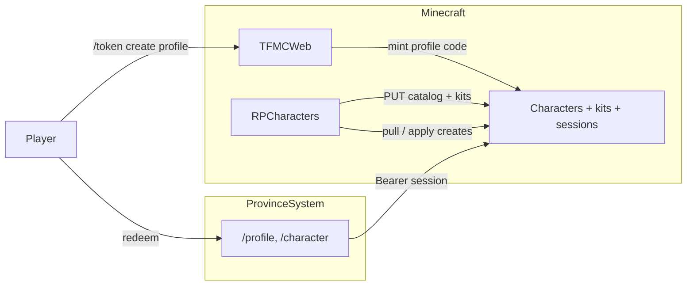

# Character creator

Web + RPCharacters character creation, kits, lore customise, and wardrobe.

**Repos:** `rpcharacters/` · `ProvinceSystem` · `tfmcweb/` · `frontend` · (kits) `armourshop/`

**Depends on:** TFMCWeb identity + `/token create profile` ([identity/tfmcweb.md](../identity/tfmcweb.md)).

## Why

Donators (and later all players) create and manage RP characters on the website with the **same rules as in-game** `/rpcharacter create` / menu. Creation stages sync from the server so YAML edits update the site after reload. Auth stays **in-game tokens** (no website accounts).

## Character creation

### Auth

| Decision | Choice |
|----------|--------|
| Proof of account | In-game `/token create profile` (UUID-bound, Discord-eligible); redeem at `/profile` |
| Code lifetime | Consumed **on redeem** |
| After redeem | API **session** Bearer - default **8h**; Remember me **30d** |
| Storage | sessionStorage if not remembered; localStorage if Remember me |
| Website accounts | **None** |

### Attribute point-buy

| Rule | Value |
|------|-------|
| Attributes | strength, dexterity, constitution, intelligence, wisdom, charisma |
| Pool | **12** points - must spend exactly 12 |
| Max rank per attribute at creation | **+2** |
| Cost for *n*-th rank in one attribute | **n** points (1st → 1, 2nd → 2) |
| Sync | Formula + caps exported in creation catalog |

Personality / physical / celestial / story traits stay **selection** stages.

### Creation catalog sync

RPCharacters on enable/reload **PUT**s a full-replace snapshot to ProvinceSystem (stage order, options, validation rules, slot limits, attribute formula). Web **GET**s snapshot for the wizard.

### Characters API + ownership

| Concern | Owner |
|---------|--------|
| Source of truth for living characters | **RPCharacters** |
| Web sessions / create requests | **ProvinceSystem** Characters API |
| Apply web creates into RPC | RPCharacters pull/ingest |
| Identity + mint | TFMCWeb + Discord link |

### Product / UI

| Decision | Choice |
|----------|--------|
| Nav | **Character** tab beside Map and Skins |
| Landing | Session → list characters (alive + dead); CTA to create if free slot |
| Create | Multi-step wizard from synced stages |
| Slots | Enforce synced limits (default 3; Gilded 4; Ascended/Legacy 5; hard cap 10) |
| Dual path | In-game `/rpcharacter create` remains; both paths share validation |

## kits (summary)

Configurable kits in `plugins/RPCharacters/kits.yml`:

| Rule | Choice |
|------|--------|
| Claim command | `/rpcharacter kit <kitId>` with that character **active** |
| Cooldown | **Per kit** (player UUID × kit id) |
| Once per character | Per kit `once-per-character: true|false` |
| Sync | All kit defs + per-character status → ProvinceSystem |

## kit item customise (summary)

Customise **editable** kit lines on the website (character detail → Kits → Edit). Texture via player skins pipeline → `ps_items`; lore via RPCharacters. Block claim while skin pending approval or slug missing on ArmourShop.

**Kit uploads:** new textures (or book covers / 3D model) on editable kit items use **character login only** — no skin mint token. Picking an already-**applied** skin from your account pick list also does not consume a mint token. Standalone cosmetics on [`/skins`](../cosmetics/skins.md) still require a **skin mint token** from TFMCWeb.

Applied skins appear in the kit editor pick list and can be attached to any character with the same `base_set`.

Editable templates: `2d-template` (required), optional `3d-template`. Book journals use kind `book` (unsigned + signed PNGs).

## wardrobe (summary)

| Concern | Choice |
|---------|--------|
| Slots | `base` + `masked` + up to 2 extras by rank |
| PNG | **64×64 only**; MineSkin v2 sign |
| Apply | Join + character switch; `/rpcharacter wardrobe` in-game |
| Web | Standing frames; modal preview |

Separate from item `/skins` and RP identity masks.

## Architecture

## Out of scope

- Website passwords / OAuth
- Rewriting non-attribute selection stages into sheets (unless redesigned later)

Operator checklist: [STAGING.md](../../STAGING.md).
