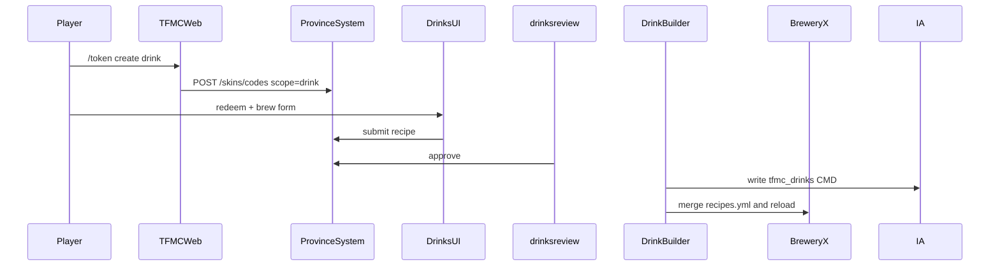

> Canonical documentation: [TF-Minecraft/docs](https://github.com/TF-Minecraft/docs). [Source snapshot](https://github.com/TF-Minecraft/ProvinceSystem/blob/9b34fd3fd336af9025ca187ca9610690695c0efa/docs/cosmetics/drinks.md). Commands and plain-text code/config paths refer to the source repository unless stated otherwise.

# Drink Builder (BreweryX)

End-to-end design for donator **custom BreweryX recipes**: token → website brew form → Discord review → DrinkBuilder writes ItemsAdder `tfmc_drinks` (optional texture) + merges `recipes.yml`.

**Status:** Code **shipped**. Operator staging smoke in [STAGING.md](../../STAGING.md).

**Repos:** `Workspace/drinkbuilder/` · `Workspace/tfmcweb/` · `ProvinceSystem/` · `tfmc_bot/` · ItemsAdder `tfmc_drinks` · BreweryX

**Related:** [cosmetics/skins.md](skins.md) · [identity/tfmcweb.md](../identity/tfmcweb.md) · [flows/journeys.md](../flows/journeys.md)

## Goals

- Replace the closed-source DrinkBuilder GUI + staff-ticket flow with TFMCWeb token + website + Discord review (same pattern as skins).
- Curated ingredient allowlist in DrinkBuilder synced to the site.
- Optional custom potion PNG → IA `tfmc_drinks` with forced CMD; BreweryX `customModelData` matches.
- Texture **reuse** across drinks (refcount); staff delete without orphaning shared skins.
- **Shared mint cooldown** skin↔drink owned by **TFMCWeb**.

## Locked product rules

| Rule | Choice |
|------|--------|
| Token | `/token create drink` → scope `drink`; redeem on `/drinks` |
| Shared cooldown | Skin + drink share one clock; config **only on TFMCWeb** |
| Noble | Can mint drink; **color-only** (no custom texture upload/reuse) |
| Gilded+ | Can upload texture **or** reuse an existing owned drink texture |
| Ingredients | Allowlist in DrinkBuilder `ingredients.yml`; sync catalog to PS/web. Historical seed: [assets/drink-ingredients-draft.yml](../assets/drink-ingredients-draft.yml) |
| Texture base | Vanilla **potion** + CMD - never paper |
| IA namespace | **`tfmc_drinks`** |
| Color xor texture | Color-only **or** custom texture, not both |
| Review | One Discord submission = recipe + optional texture / color sheet |
| Delete | `/drinkbuilder drink delete <id>`; remove recipe; free IA texture only if refcount = 0 |

## Rank ladder (mint + texture)

| Rank | Shared cooldown | Mint drink | Custom texture |
|------|-----------------|------------|----------------|
| defaults | disallowed | no | no |
| Noble | 28 days | yes | no (color only) |
| Gilded | 21 days | yes | yes |
| Ascended | 14 days | yes | yes |
| Legacy | 7 days | yes | yes |

## High-level flow

## Data (ProvinceSystem)

- `drink_submissions` - recipe JSON, status, player UUID, optional texture
- `drink_textures` - owner UUID, CMD, IA id, refcount, png path
- `drink_catalog` - ingredients allowlist + category labels + effects blacklist
- `drink_player_meta` - `allow_drink_texture` + `name_colour_stops`
- `drink_notifications` - staff/bot outbox

**API (`/drinks`):** redeem · submit · catalog · staff pending/approve/deny · plugin catalog/meta.

## Plugin surface (DrinkBuilder)

| Command | Role |
|---------|------|
| `/drinkbuilder reload` | Reload config + re-push catalog + online meta |
| `/drinkbuilder catalog sync` | Push ingredients + categories + blacklist to PS |
| `/drinkbuilder pack pull [force]` | Pull approved → IA + Brewery merge + ack |
| `/drinkbuilder drink delete <id>` | Remove recipe; free CMD iff refcount 0 |

## Website

- `/drinks` redeem + brew editor + `/drinks/[id]` status
- Session key `tfmc_drinks_session`; gate texture UI on `allow_drink_texture`
- Recipe fields: name, ingredients, cooking/distill, lore, effects, message/title, glint, color **xor** PNG/reuse
- PNG: 16×16 potion icon

## Discord

`drinksreview` cog polls `/drinks/staff/pending`, posts recipe embed + review sheet, Approve/Deny; player DMs via drink notifications outbox. See [integrations/discord-bot.md](../integrations/discord-bot.md).

## Cutover

Players use `/token create drink` then redeem on `/drinks`. Legacy ConditionalEvents `/tfmc drinks` retired.

## Out of scope

- Migrating every hand-authored Brewery recipe to IA fruit tokens
- Player-authored servercommands
- ArmourShop writing drinks
