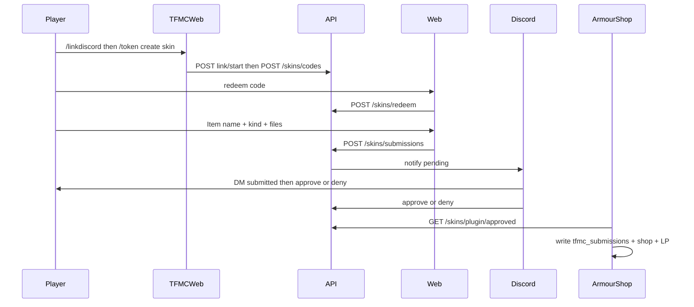

# Skins system

End-to-end design for donator texture submissions on **ProvinceSystem** (store + review state).

**See also:** [integrations/armourshop.md](../integrations/armourshop.md) (MC apply), [integrations/discord-bot.md](../integrations/discord-bot.md) (staff UI), [naming.md](naming.md), [flows/journeys.md](../flows/journeys.md).

## Goals

- Donators submit **armor sets** (2D, optional per-tier 3D helmet), **weapon/tool skins** (`handheld` / `large_handheld` / `bow` / `large_bow` / `crossbow`), **3D kinds** (`item_3d` / `shield` / `helmet_3d` / `mask`), **guns** (`gun`), and **books** (`book`; unsigned + signed covers).
- No website logins; codes from TFMCWeb (`/token create skin` or **`/token create skin staff`**) bound to player UUID.
- **Player:** staff approve/deny in Discord; ArmourShop writes **`tfmc_submissions`** + `ps_*` + LP.
- **Staff curated:** auto-approve (no bot); category + scroll on upload; writes **`tfmc_armorshop`** into real ArmourShop categories.
- **Kit item customise** (character creator) also creates `submissions` rows via an internal `lore_upload` code per player — not a donator mint token. Staff review and ArmourShop apply use the same pipeline as `/skins` uploads.

## Upload kinds

| Kind | Multipart fields | Exact sizes | Notes |
|------|------------------|-------------|-------|
| `armor_set` | Per tier: flat helmet **or** 3D model+texture; always chest/legs/boots/layers | Icons **16×16**; layers **64×32** | One SkinSet **per tier** |
| `handheld` | `texture` | **16×16** | Sword-style handheld parent |
| `large_handheld` | `texture` | **32×32** | Grip preset `bottom` / `middle` / `top` |
| `bow` | `texture`, `pull_0`, `pull_1`, `pull_2` | **16×16** | |
| `large_bow` | same four fields | **32×32** | |
| `crossbow` | bow four + `charged` | **16×16** | |
| `item` | - | - | **Disabled** for upload |
| `item_3d` | `texture` + `model` | Pair byte budget from entitlements | `generate: false` |
| `shield` | `texture` + `model` | Same pair budget | Blocking clone at apply |
| `helmet_3d` | `texture` + `model` | Same pair budget | `set: helmets` |
| `mask` | `texture` + `model` | Same pair budget | `set: masks`. Wearing the skinned mask hides identity in RPCharacters |
| `gun` | `texture` + carry/reload/aim models | Three pair checks | GaG `skins.yml` `ia.…` |
| `book` | `unsigned` + `signed` | Both **16×16** | `base_set: books` |

Upload **filenames are ignored** for identity - the API validates PNG/JSON and writes fixed stems from the submission id. See [naming.md](naming.md).

### Grip presets (`large_handheld` only)

| `grip_preset` | Meaning |
|---------------|---------|
| `bottom` | Hold near bottom of art (hammer/staff-like) |
| `middle` | Hold mid-art |
| `top` | Hold toward top (longsword-like) |

## High-level flow



## Code rules

| Rule | Behavior |
|------|----------|
| Bound to UUID | Issued with `player_uuid`; cosmetic always granted to that UUID |
| Storage | Hash of code (SHA-256); plaintext shown once in-game |
| Lifetime | Code row expiry; **session 8h** after redeem |
| Consumption | Code marked used **on successful submit**, not on redeem |
| Mint cooldown | **Owned by TFMCWeb** (shared with drink) |
| Allowed kinds | Per-rank additive `skin-kinds` whitelist |

**Command gate:** TFMCWeb LP `tfmcweb.token.create`. **Staff (`skin_staff`):** bypasses mint cooldown and upload gates.

Upload requires a prior **Discord link** for that UUID ([identity/tfmcweb.md](../identity/tfmcweb.md)).

## Skin-upload entitlements (TFMCWeb)

Configured in TFMCWeb `config.yml` `player-meta.skins`; pushed on join/reload via `PUT /characters/plugin/rpc-player-meta`. `PUT /skins/plugin/player-meta` is deprecated.

| Rank | Cooldown | Kinds (additive inherit) | Armor 3D helmet |
|------|----------|--------------------------|-----------------|
| defaults / no rank | disallowed | none | false |
| Noble | 28 days | handheld, large_handheld, bow, large_bow, crossbow, book | false |
| Gilded | 21 days | + armor_set | false |
| Ascended | 14 days | + item_3d, shield, helmet_3d, mask, gun | true |
| Legacy | 7 days | (same as Ascended) | true |

## Discord link (MC ↔ Discord)

**Owner: TFMCWeb.**

| Step | Who | What |
|------|-----|------|
| 1 | Player in game | `/linkdiscord` → `POST /skins/discord/link/start` |
| 2 | Player in Discord | `/linkdiscord <code>` → bot `POST /skins/discord/link/complete` |
| 3 | API | Stores `discord_links` row |

Player DMs: submitted (outbox poll); approved / denied from cog after staff API call.

## Storage

### SQLite

- `codes` - hashed codes, player UUID, expiry, redeemed_at on submit
- `submissions` - kind, display_name, status, paths, discord_user_id, tiers, base_set, grip_preset, name colours/styles
- `discord_links` / `discord_link_codes` - identity bind

### Disk

```text
backend/src/data/skins/{submission_id}/
  meta.json
  …fixed stems per kind…
```

## Validation (summary)

- Id from IGN + item name per [naming.md](naming.md)
- PNG magic bytes; max bytes; **exact** pixel sizes
- `base_set` required for non-armor kinds; `tiers` for armor
- 3D kinds: vanilla Java Block/Item JSON (`elements` + single-axis 22.5°/45° rotation); display autofill; pair byte caps
- Requires Discord link stamp at submit

## Review preview

| Phase | What the API serves | Who consumes |
|-------|---------------------|--------------|
| Contact sheet | Composite `review-sheet` PNG (2D textures + 3D tiles when renderer is available) | Website status page + Discord `#bot-feed` |
| Render failure | `preview_render_error.txt` on disk; staff `X-Sheet-Render-Error` header; Discord **3D preview** embed field | Staff only (texture-only sheet still attached) |

Deploy and verify the headless renderer: [ops/sheet-render.md](../ops/sheet-render.md).

## HTTP contracts

### TFMCWeb → API (`X-Plugin-Key`)

| Method | Purpose |
|--------|---------|
| `POST /skins/discord/link/start` | Issue link code |
| `POST /skins/codes` | Mint skin code |

### ArmourShop → API (via TFMCWeb gateway)

| Method | Purpose |
|--------|---------|
| `GET /skins/plugin/approved?since=…` | Pull approvals |
| `POST /skins/plugin/applied` | Ack applied |

### Web → API (after redeem)

| Method | Purpose |
|--------|---------|
| `POST /skins/redeem` | `{ "code" }` → session |
| `POST /skins/submissions` | Multipart upload |
| `GET /skins/submissions/check` | Display name conflict check |
| `GET /skins/submissions/{id}` | Status for owner session |

### Discord bot → API (`X-Staff-Key`)

| Method | Purpose |
|--------|---------|
| `POST /skins/discord/link/complete` | Complete link |
| `GET /skins/staff/pending` | List pending |
| `GET /skins/staff/notifications` | Player notify outbox |
| `GET /skins/staff/submissions/{id}/files/{filename}` | Download PNG |
| `GET /skins/submissions/{id}/review-sheet` | Contact sheet |
| `POST /skins/submissions/{id}/approve` | Approve |
| `POST /skins/submissions/{id}/deny` | Deny + purge |

### Staff-only inspect

| Method | Purpose |
|--------|---------|
| `POST /skins/codes/inspect` | Decode a redeem code (staff Bearer + `tfmc.map.staff`) |

See [identity/auth-security.md](../identity/auth-security.md).

## Frontend (`/skins`)

1. Enter code → redeem  
2. Choose kind → fixed slots per kind  
3. Armor: **Add tier** flow (1-6 tiers)  
4. Enter **Item name**; colours / styles / live preview  
5. Submit → status page with review sheet  

## Security (skins-specific)

- Plugin and staff secrets only in server env  
- Rate-limit redeem and upload  
- Review sheets for staff only  
- No public list-all-submissions endpoint  

Local MVP: [ops/local-dev.md](../ops/local-dev.md).
