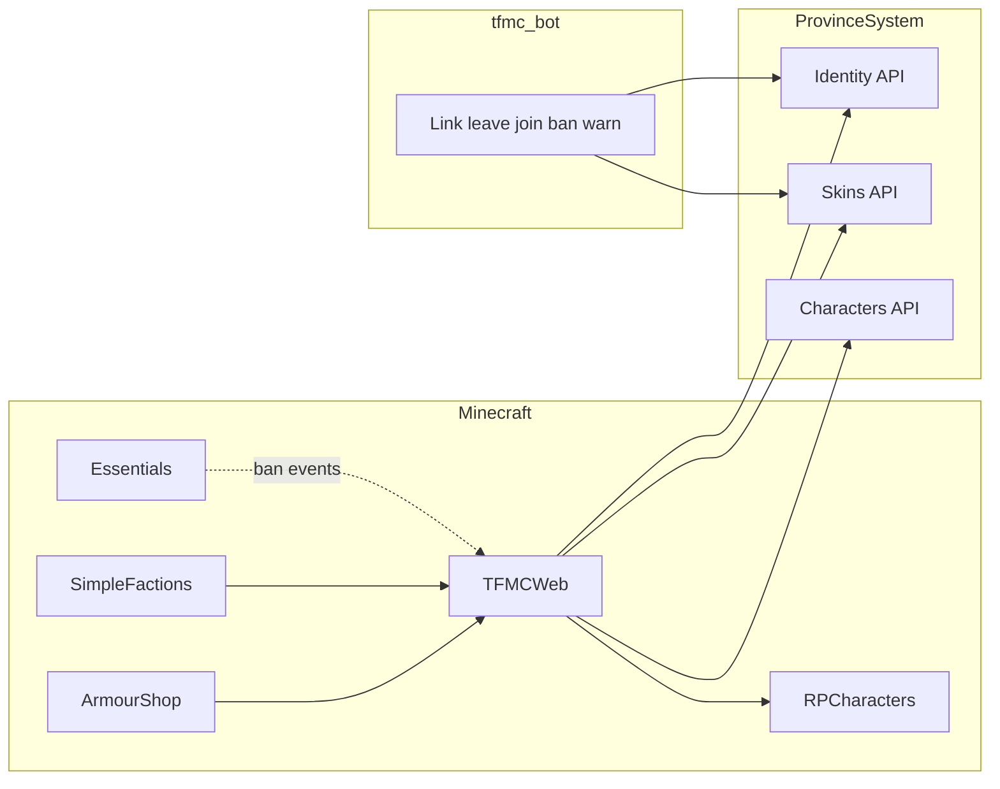

# TFMCWeb (identity, tokens, Discord gate)

**Status:** Implemented.

**Repos:** `Workspace/tfmcweb/` (Bukkit plugin) · `ProvinceSystem` · `tfmc_bot` · soft-depends `Workspace/rpcharacters` · consumers `armourshop`, `drinkbuilder`, SimpleFactions

Companion: [integrations/discord-bot.md](../integrations/discord-bot.md) · [cosmetics/skins.md](../cosmetics/skins.md)

## Why

**TFMCWeb** is the single TFMC-specific gate to ProvinceSystem (like **TFMCCore** is TFMC-specific gameplay; **TLibs** stays portable). It owns identity + tokens; ArmourShop keeps pack apply; SimpleFactions has its own HTTP for map; character creation uses the same identity + scoped codes.

## Locked decisions

| Decision | Choice |
|----------|--------|
| Plugin name | **TFMCWeb** (`net.tfminecraft.TFMCWeb`) |
| Owns | HTTP client, plugin key, Discord **link**, scoped **tokens**, link **cache**, Discord **gate** (via RPCharacters freeze), ban/warn **mirrors**, admin `/web` |
| Does **not** own | Pack writing (ArmourShop/DrinkBuilder), map regen (SimpleFactions), character data (RPCharacters), Essentials ban execution |
| Discord required | Every player must link Discord **and** be in the TFMC guild to play Survival |
| Staff / helpers | Discord gate applies **only in Survival** |
| Alts | **None** - one Discord ↔ one Minecraft UUID |
| Leave Discord | **1 hour grace** - rejoin within 1h stays linked; after grace → unlink + freeze |
| Freeze | **RPCharacters** freeze reason `DISCORD_REQUIRED`; do not touch characters |
| Bans | Essentials `/tempban` / `/ban`; TFMCWeb mirrors to Discord bot |
| Warnings | `/warning` (TFMCWeb) → player chat + web store + bot DM |

## Ownership matrix

| Concern | Owner |
|---------|--------|
| Base URL, `X-Plugin-Key`, async HTTP | TFMCWeb (`ProvinceSystemGateway`) |
| UUID ↔ Discord link + guild membership + grace | ProvinceSystem identity + TFMCWeb cache + bot leave/join |
| Scoped feature codes (`skin`, `drink`, `character`, …) | ProvinceSystem + TFMCWeb `/token create <scope>` |
| Survival Discord gate freeze | TFMCWeb → RPCharacters API |
| Skin pack apply | ArmourShop (HTTP via TFMCWeb gateway) |
| Drink pack apply | DrinkBuilder (HTTP via TFMCWeb gateway) |
| Character ingest / roster | RPCharacters (HTTP via TFMCWeb gateway) |
| Essentials ban/unban | Essentials executes; TFMCWeb mirrors |
| Discord DMs / banned role / leave events | `tfmc_bot` |

Domain plugins **depend on TFMCWeb** for network/identity. They do not open raw HTTP to ProvinceSystem once migrated.

## Architecture

## Identity

Link tables live under skins SQLite (`discord_links`, `discord_link_codes`) and routes under `/skins/discord/…` (identity module extraction to `/v1/identity/…` is a future cleanup).

| Route | Auth | Role |
|-------|------|------|
| `POST /skins/discord/link/start` | Plugin | Issue link code |
| `POST /skins/discord/link/complete` | Staff (bot) | Bind Discord id; reject if Discord already on another UUID |
| `POST /skins/discord/link/unlink` | Plugin | Explicit unlink |
| Guild leave/join | Staff (bot) | 1h grace on leave; clear on rejoin |

## War declare codes

One-time codes that gate an in-game war declaration. Staff mint one in Discord (`tfmc_bot` `factions` cog, `/warcode`), the attacking leader types it in SimpleFactions, and it pins the war goal. Rows live in `war_declare_codes`, realm-scoped, hashed with **no plaintext column**: staff see the code once and a lost code is revoked and reminted.

| Route | Auth | Role |
|-------|------|------|
| `POST /wars/declare-codes` | Staff (bot) | Mint; returns `{id, code, expires_at}` once |
| `POST /wars/declare-codes/validate` | Plugin | Non-consuming; returns the pinned goal |
| `POST /wars/declare-codes/redeem` | Plugin | Consuming; sets `redeemed_at` and `redeemed_war_id` |
| `GET /wars/declare-codes` | Staff (bot) | Outstanding codes; ids and metadata, never a code |
| `POST /wars/declare-codes/revoke` | Staff (bot) | Revoke by id |
| `GET /wars/declare-codes/goals` | Staff (bot) | The nine declarable goals |

Rules:

- Validate and redeem are separate calls because `WarManager.declareWar` can still refuse after the code was accepted. Redemption happens only once a war exists, so a rejection does not burn a staff-approved ticket.
- Both re-check attacker, defender and realm against the row, so a code minted for one pairing cannot be spent on another.
- **Goal allowlist:** nine of the thirteen `WarGoalType` values. `overthrow`, `change_law`, `change_tax` and `force_peace` are raised by a political movement, never declared, and are refused at mint.
- `realm_id` on the two plugin routes is injected by **TFMCWeb**, not sent by SimpleFactions, which does not know its own realm.
- TTL from `WAR_CODE_TTL_HOURS` (default 48, mint may override up to 720).

## Tokens

| Command | Scope | Redeems on |
|---------|--------|------------|
| `/token create skin` | `skin` | `/skins` |
| `/token create drink` | `drink` | `/drinks` |
| `/token create character` | `character` | `/character` |
| `/token create skin staff` | `skin_staff` | `/skins` (auto-approve) |

Rules:

- Must be Discord-linked and not past grace (Survival players).
- Codes bound to UUID.
- Session TTL: default **8h** after redeem; Remember me **30d** for character.
- Codes consumed on submit (skin/drink) or create (character).
- **Shared mint cooldown (`skin` + `drink`):** owned by **TFMCWeb** only. Character is not in the shared family.
- **Command gate:** LP `tfmcweb.token.create`; staff perm `tfmcweb.token.create.staff`.
- Skins **upload** entitlements remain ArmourShop → PS player-meta.

## Discord gate + RPCharacters freeze

1. Player in **Survival** and (not linked **or** grace expired after leave) → **freeze**.
2. Linked + in guild (or within 1h grace) → clear Discord freeze reason.
3. **Do not** change active character or delete characters.
4. Non-Survival → **no Discord gate**.

TFMCWeb on join / notice / grace tick: set or clear gate → `reevaluateFreeze(player)`.

## Bans and warnings

- **Bans:** Essentials executes; TFMCWeb enqueues moderation outbox → bot DM + **Banned** role; unban clears role.
- **Warnings:** `/warning <player> <reason>` → in-game chat + web store + bot DM.

Bot does **not** execute MC bans.

## Commands (TFMCWeb)

### Player

| Command | Action |
|---------|--------|
| `/linkdiscord` | Issue link code |
| `/unlinkdiscord` | Explicit unlink |
| `/token create skin\|drink\|character` | Scoped code |
| `/token resetcooldowns <player>` | Clear shared skin+drink mint cooldown |

### Staff

| Command | Action |
|---------|--------|
| `/web status` | API reachability, link cache stats |
| `/web reload` | Reload config |
| `/web lookup <player>` | UUID ↔ Discord / grace |
| `/web unlink <player>` | Force unlink |
| `/warning <player> <reason>` | Warn + mirror |

## Realm gateway

Per-realm HTTP gateway, `rpc_player_meta` sync, realm-scoped token policy, and scoped data queues are **shipped**. Map staff permission `tfmc.map.staff` arrives via player meta for staff map and editor gates.

### Site-wide snapshots are owned by the primary server

The creation catalog, kit skins, masked template, ArmourShop catalog, DrinkBuilder catalog and drink assets are stored **once for the whole site**, and their push routes carry no `realm_id`. Every server pushes them on start, so a dev or tutorial restart used to replace the live copy.

Non-primary servers therefore use their own key: list it in `PLUGIN_KEYS_SECONDARY` (comma-separated, `backend/.env`) and set it as `api.plugin-key` in that server's TFMCWeb config. A secondary key works on every plugin route, but pushes to the routes above answer `200` with `"ignored": true` and store nothing. Only the `PLUGIN_KEY` server decides what the website shows.

## Success criteria

- Survival player without Discord link (or past leave grace) is frozen via RPCharacters; characters untouched.
- Staff in non-Survival are not Discord-gated.
- Leave Discord → 1h grace → rejoin OK; after 1h → freeze.
- No alts (one Discord ↔ one UUID).
- `/token create skin`, `drink`, and `character` work from TFMCWeb.
- Shared skin↔drink mint cooldown enforced on TFMCWeb.
- `/tempban` mirrors to Discord; `/warning` hits chat + Discord.
- ArmourShop no longer owns link/HTTP identity.

Staging verify: [STAGING.md](../../STAGING.md).
