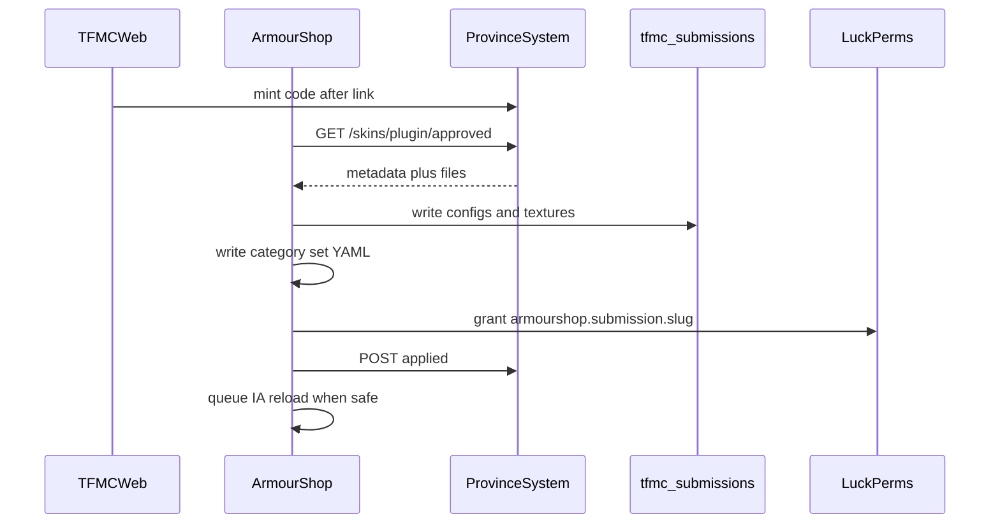

# ArmourShop and ItemsAdder

How approved website skin submissions become **usable cosmetics** on the Minecraft server.

Website/API contracts: [cosmetics/skins.md](../cosmetics/skins.md). Naming: [cosmetics/naming.md](../cosmetics/naming.md).

## Role split

| Actor | Does |
|-------|------|
| ProvinceSystem | Codes, uploads, Discord review (players); staff auto-approve; catalog store |
| **TFMCWeb** | `/linkdiscord`, `/token create skin`, notice poller, Survival Discord gate |
| **ArmourShop** | Catalog sync on load; pull approved; write IA + shop YAML; LP for **player** submissions |
| ItemsAdder | Loads `tfmc_submissions` (players) and `tfmc_armorshop` (staff curated) |
| SimpleFactions | Nothing here |

ArmourShop is the **only** writer into live `contents/tfmc_submissions/` (player) and `contents/tfmc_armorshop/` (staff). Legacy hand-edited `tfmc_armor` stays as-is.

## Two lanes

| Lane | Token | Pack | Shop | Unlock | Review |
|------|-------|------|------|--------|--------|
| Player | `/token create skin` | `tfmc_submissions` | `ps_armor` / `ps_items` | LP `armourshop.submission.*` | Discord approve |
| Staff | `/token create skin staff` | **`tfmc_armorshop`** | Chosen category + **scroll** | Scroll consume | **Auto-approve** (no bot) |

Catalog (categories, skin-set keys, scrolls from AS config) syncs ArmourShop → API on load so website dropdowns stay honest.

**Ops:** `/armourshop catalog sync` force-refreshes catalog. Staff pack pulls write **`tfmc_armorshop`** and upsert the chosen category YAML; no submission LP.

## Paths

| Piece | Location |
|-------|----------|
| Plugin source | `Workspace/armourshop/` |
| Live shop YAML | `Workspace/plugins/ArmourShop/Categories/` |
| IA contents (live) | `Workspace/plugins/ItemsAdder/contents/` |
| IA reference copy | `ItemsAdder Copy/ItemsAdder/contents/` |

## Apply flow



## ItemsAdder: `tfmc_submissions`

Namespace: **`tfmc_submissions`**.

**Armor set** (2D, multi-tier) - mirror `tfmc_armor`, **once per tier**:

- `armors_rendering.{id}_{tier}` with `layer_1` / `layer_2`
- Four items per tier with `generate: true`, icon textures, `custom_armor: {id}_{tier}`
- Icons 16×16 and layers 64×32 (API enforced)

**2D / weapon skins** - single item id `{slug}`:

| Kind | Resource |
|------|----------|
| `handheld` | `generate: true` + `parent: item/handheld` |
| `large_handheld` | `generate: false` + grip template model |
| `bow` / `large_bow` / `crossbow` | ArmourShop writers; pull/draw frames |
| `book` | `{slug}` (`WRITABLE_BOOK`) + `{slug}_signed` (`WRITTEN_BOOK`); shop lists `{slug}` only |
| `item_3d` | `generate: false` + donor JSON (`PAPER`) |
| `helmet_3d` | `CARVED_PUMPKIN` + `behaviours.hat: true` (armor-set 3D helmets use the same) |
| `shield` | Donor JSON + ArmourShop blocking clone |
| `gun` | STONE_HOE carry/reload + CROSSBOW aim; GaG `skins.yml` |

Never add new skins via manual `custom_model_data` lists in legacy `tfmc_pack`.

## Discord link (before skins upload)

| Command | Where | API |
|---------|-------|-----|
| `/linkdiscord` | In game (TFMCWeb) | `POST /skins/discord/link/start` |
| `/linkdiscord <code>` | Discord (tfmc_bot) | `POST /skins/discord/link/complete` |
| `/token create skin` | In game (TFMCWeb) | `POST /skins/codes` scope=skin |
| `/token create skin staff` | In game (TFMCWeb) | `POST /skins/codes` scope=skin_staff |

Mint cooldown for skin+drink is on **TFMCWeb** only. Upload entitlements (kinds, colours, 3D) sync from ArmourShop `permission-groups.yml`.

## ArmourShop shop integration

Player submissions use:

```text
ia.tfmc_submissions:{id}_{tier}_helmet   # armor, per tier
ia.tfmc_submissions:{id}                 # non-armor
```

- Categories: **`ps_armor`** (`is-item: false`) and **`ps_items`** (`is-item: true`)
- Non-armor SkinSet `set: {base_set}` from upload
- Armor: one SkinSet per tier, key `{id}_{tier}`, `set: {tier}`
- Gate with `permission: armourshop.submission.{id}` (one LP node per submission, all tiers)
- **No scroll** on player submission sets

Staff delete: `/armourshop submission delete <submissionId>` removes pack/shop/LP + API `revoked`, then **enqueues** deferred IA refresh (never immediate `iareload`).

## LuckPerms

On apply: grant issuer UUID `armourshop.submission.{id}` - one shared node for the whole submission.

## Deferred reload

1. Write files immediately.
2. If players online → mark pending reload.
3. When `onlineCount == 0` or on restart → console **`iazip`**.
4. On `ItemsAdderPackCompressedEvent` → `POST /skins/plugin/applied`.

Delete uses the same deferred queue - never immediate reload even with staff online.

## Config (plugin)

| Key | Purpose |
|-----|---------|
| `skins-api.base-url` | ProvinceSystem (no trailing slash) |
| `skins-api.plugin-key` | `X-Plugin-Key` |
| `pack-apply.ia-contents-path` | Absolute path to ItemsAdder `contents/` |
| `pack-apply.categories-path` | Absolute path to ArmourShop `Categories/` |

Do **not** commit staging `base-url` / `plugin-key` as repo defaults.

## Local / dry run

Point ArmourShop at `ItemsAdder Copy` (or a temp contents dir), not production. Pull from local API with mock approved submissions. See [ops/local-dev.md](../ops/local-dev.md).

## See also

- [flows/journeys.md](../flows/journeys.md) - skin journey
- [integrations/discord-bot.md](discord-bot.md) - approval before pull
