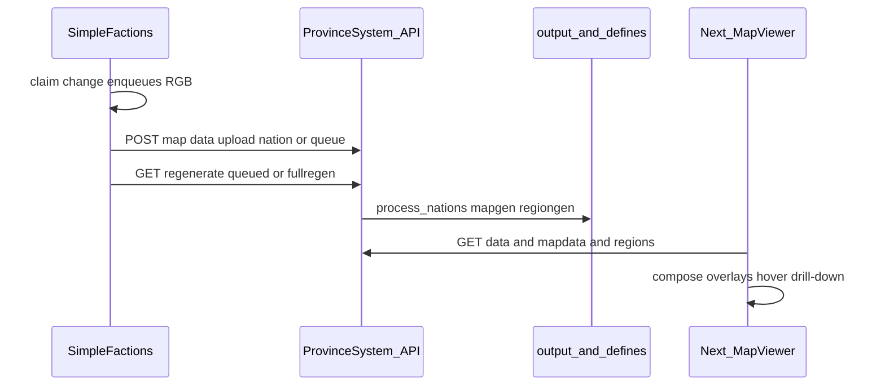

# Map generation pipeline

End-to-end **interactive world map**: faction data on the Paper server becomes PNG layers and JSON on the website.

Product goals: [overview.md](overview.md). Performance detail: [viewer.md](viewer.md).

## Components

| Piece | Path | Job |
|-------|------|-----|
| SimpleFactions | `simplefactions/` | Owns nations/provinces; talks HTTP to API |
| ProvinceSystem API | `ProvinceSystem/backend/` | Upload defines, regen maps/regions, serve files |
| ProvinceSystem web | `ProvinceSystem/frontend/` | MapViewer, modes, drill-down |
| Data | `backend/src/input\|defines\|output/{map}/` | Per-map worlds (`main`, `dev`, …) |

## Flow

## SimpleFactions REST

Primary client: `simplefactions/src/main/java/net/tfminecraft/simplefactions/rest/RestServer.java` - delegates to TFMCWeb `ProvinceSystemGateway` via `api/GatewayClient.java`.

| Call | Purpose |
|------|---------|
| `GET {api}/{mapRef}/map/province/{x},{z}` | Resolve province under player |
| `POST {api}/{mapRef}/data/upload/{mode}` | Push nation / provinces / guilds / queue / `map_markers` / titles (internal IP) |
| `GET {api}/{mapRef}/{hashedKey}/api/regenerate/{type}` | `textonly`, queued, or `fullregen` |
| `GET {api}/generator/banner` | Random banner patterns |

Config knobs:

| Where | Key | Purpose |
|-------|-----|---------|
| **TFMCWeb** `config.yml` | `api.base-url`, `api.plugin-key` | ProvinceSystem HTTP (all SF map calls) |
| **SimpleFactions** `config.yml` | `map-reference` | `Cache.mapRef` - which map folder (`main`, `dev`, …) |
| **SimpleFactions** `config.yml` | `enable-map` | `Cache.mapEnabled` - kill switch |

SimpleFactions **soft-depends** on TFMCWeb; with `enable-map: true` and TFMCWeb missing, SF logs a severe startup warning and map HTTP fails at runtime.

Claim changes typically `enqueue("nation", rgb)` then later upload queue + regenerate.

## ProvinceSystem map pipeline

1. Load/compile nation (and other modes) into `defines/{map}/`.  
2. `create_map` / `generate_regions` write `output/{map}/maps/` and `regions/`.  
3. [`file_routes`](https://github.com/TF-Minecraft/ProvinceSystem/blob/main/backend/src/api/file_routes.py) serves PNGs; data routes serve JSON (including `GET /{map}/data/markers` for settlement pins). Infestation overlay is `output/{map}/maps/infestation_map.png` from `infestation_data.json` (yellow to dark red, no green).  
4. Frontend uses `NEXT_PUBLIC_API_URL` + `mapId` (e.g. `/map/main`); `app/components/map/MapMarkerLayer.tsx` (layout in `app/lib/settlementMarkers.ts`) renders pins + straight labels on political modes when zoomed in.

## Multi-map

Each logical world has its own `input/{map}`, `defines/{map}`, `output/{map}`. SimpleFactions `mapRef` must match the website `mapId` for that season/world.

## Local vs live

| Mode | Map data |
|------|----------|
| Website only | Sample `input`/`defines` + one-shot regen → `output` ([ops/local-dev.md](../ops/local-dev.md)) |
| Integration | TFMCWeb `api.base-url` → local/staging API; SF `map-reference` = test mapRef |
| Production | SF on Paper → live API; players browse tfminecraft.net |

SimpleFactions is **not** involved in skins.

Integration summary (queue upload, regen, loopback URL contract): [integrations/simplefactions.md](../integrations/simplefactions.md).

## See also

- [flows/journeys.md](../flows/journeys.md) - journey "map border update"
- [ledger.md](ledger.md) - economy ledger and wealth charts
