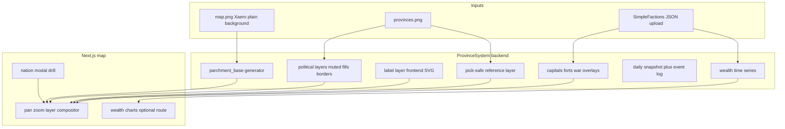

> Canonical documentation: [TF-Minecraft/docs](https://github.com/TF-Minecraft/docs). [Source snapshot](https://github.com/TF-Minecraft/ProvinceSystem/blob/9b34fd3fd336af9025ca187ca9610690695c0efa/docs/map/overview.md). Commands and plain-text code/config paths refer to the source repository unless stated otherwise.

# Map platform overview

Turn the live political map from flat colour blobs into a **fantasy cartography product**: parchment terrain, muted realm overlays, nation labels, rich nation popups, settlements and forts, war layers, daily chronicle snapshots, and wealth analytics - while staying fast on desktop and mobile.

**Repos:** ProvinceSystem (FE + BE mapgen) · SimpleFactions (export + upload) · TFMCWeb (staff map gate)

**Technical refs:** [generation.md](generation.md) · [viewer.md](viewer.md) · [title-editor.md](title-editor.md) · [wars-on-map.md](wars-on-map.md)

## Goals

| Area | Status |
|------|--------|
| Fast refined layout, click modal, drill-down, cropped overlays, mobile | Shipped |
| Xaero world map → colour base + ink parchment washes | Shipped |
| Fantasy muted nation overlays | Shipped |
| Nation / title / trade labels; Calavorn terrain/fertility/trade/prosperity/infestation modes | Shipped |
| Pan and zoom (wheel + middle-mouse pan, clamped bounds) | Shipped |
| Staff-only maps (configurable per `mapId`) | Shipped |
| Named capitals / guild settlements | Shipped |
| Forts + zone of control | Shipped |
| Wars: campaign route line + battle pins | Shipped |
| Wars: occupier nation fill (`occupied_by`) | Shipped |
| Wars: dedicated occupation overlay | Planned |
| Daily map snapshots + changelog | Planned |
| Nation / global wealth charts over time | Planned |
| Staff web map title editor (county → empire) | Shipped |

## Architecture

### Layer model

| Layer | Source | Purpose |
|-------|--------|---------|
| `parchment_base` | `input/{map}/map.png` + grade/texture → `output/.../parchment_base.png` | Terrain backdrop |
| `political_{mode}` | `provinces.png` + nation defines | Desaturated fills, borders, hover |
| `labels_{mode}` | Province graph + nation names (frontend SVG) | Straight text per contiguous blob |
| `markers` | SF export (`capitals`, `forts`, …) | Town/fort icons |
| `war_{id}` | SF war export | Campaign line, battle pins, occupier fill (dedicated contested overlay planned) |
| `pick_{mode}` | Raw RGB map (`apply_overrides=False`) | Hit-testing only; never styled away |

Pick layer must stay separate from display (see [`mapgen.py`](https://github.com/TF-Minecraft/ProvinceSystem/blob/9b34fd3fd336af9025ca187ca9610690695c0efa/backend/src/scripts/mapgen/mapgen.py) `apply_overrides=False` rule) so vassal pixels remain selectable.

## Locked product rules

| Rule | Choice |
|------|--------|
| Grid alignment | `map.png` and `provinces.png` share the same pixel grid per `mapId` |
| Nation colour | Desaturated/dulled vs raw `rgb` in nation.json; parchment masked interior optional |
| Interaction | **Click** → nation detail modal; **Ctrl+click** (Cmd on Mac) → drill into subjects; mobile: tap + explicit drill |
| Staff maps | Gated by profile Bearer session + `permission_flags["tfmc.map.staff"]` from TFMCWeb/LP sync; `public` vs staff per map in PS `maps.yml` + SF `mapRef` |
| SF export | Draft schema: [`map-export-schema.json`](../assets/map-export-schema.json) |
| Wars | **Do not infer** frontlines from territory diffs alone; require SF war export ([`../../simplefactions/docs/wars.md`](https://github.com/TF-Minecraft/ProvinceSystem/blob/9b34fd3fd336af9025ca187ca9610690695c0efa/simplefactions/docs/wars.md)) |
| Chronicle | Daily composited snapshot + structured event log (prefer SF-emitted events over pure JSON diff) |
| Wealth history | Append-only time series from nation upload `balance` + global aggregate |

## SimpleFactions contract (summary)

Nation upload (`nation.json`) already carries `balance`, `provinces`, `relations`, etc. Extensions for map platform:

- `capitals` - faction + guild named capitals with province id and map pixel coords
- `settlements` - guild towns beyond distance threshold from faction capital
- `forts` - fort id, province, ZOC province list
- `wars` - belligerents, campaign route slice, battle schedule pins, `occupied_by_*` lists
- `province_data.occupied_by` - occupier faction id for nation-overlay remap
- `events` - explicit chronicle events (war declared, province taken, capital moved, …)
- `global_wealth` - optional aggregate for charts

Capitals must be **named in-game** via SF (`setcapital` / guild capital rules) before they appear on the web map.

Full SF ↔ API pipeline: [integrations/simplefactions.md](../integrations/simplefactions.md).

## Success criteria (map platform MVP)

- Parchment terrain + muted nations readable on desktop and phone
- Click nation → modal with size, subjects, culture, relations, wealth
- `main` public; staff maps hidden without permission
- Named capitals visible when SF exports them
- Daily snapshot + diff/event log stored (planned)
- Nation wealth chart over season (planned)

Operator checklists: [STAGING.md](../../STAGING.md).

## Out of scope (v1)

- Vector / WebGL map engine rewrite
- Auto-generated oversimplified animation video
- Rewriting mapgen in another language
