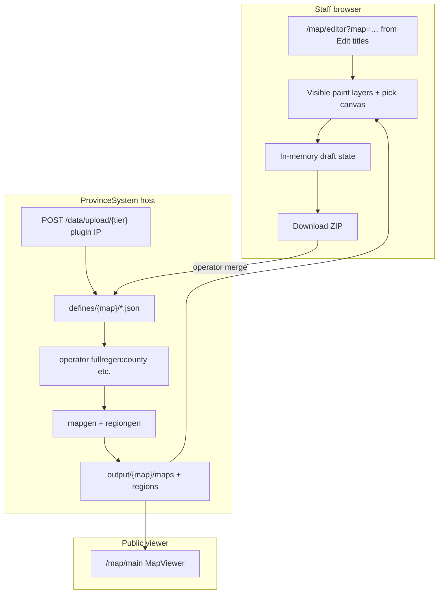

# Map title editor

Staff-gated web editor for `county` / `duchy` / `kingdom` / `empire` JSON in `defines/{map}/`: click-combine territories, name titles, pick RGB colours, export a ZIP. Hidden unless `NEXT_PUBLIC_MAP_EDITOR_ENABLED=1`.

**Repos:** ProvinceSystem (FE + BE)

**Related:** staff map gate in [overview.md](overview.md) · legacy Tkinter [`county_editor.py`](https://github.com/TF-Minecraft/ProvinceSystem/blob/main/backend/src/editor/county_editor.py)

## Goals

1. **Combine provinces into counties** - click provinces on the map, name the county, pick a title colour.
2. **Combine counties into duchies** (and duchies into kingdoms, kingdoms into empires) - same UX at each tier.
3. **Edit existing titles** - rename, change colour, add/remove members, delete a title.
4. **Clear visual layers** - selection layer (child tier or unassigned) at lower opacity; active title being built/edited at high opacity.
5. **Live canvas feedback** - colours update on click before save (no regen wait for every click).
6. **Export** - download the tier JSON as a ZIP; an operator merges it into `defines/{map}/` and runs mapgen so the public viewer reflects changes.

## Data model

Hierarchy bottom → top:

```text
Province  (provinces.txt: id = R,G,B;terrain;fertility)
  └── County   (county.json: provinces[], name, rgb, overlay)
        └── Duchy   (duchy.json: titles[] → county ids, name, rgb, overlay)
              └── Kingdom (kingdom.json: titles[] → duchy ids)
                    └── Empire (empire.json: titles[] → kingdom ids)
```

| Field | Rule |
|-------|------|
| `rgb` | Comma-separated `"R,G,B"` - unique per title **within the same tier file** for pick maps |
| `overlay` | Auto-computed on regen (`overlay_metadata.py`) - editor does not require manual bbox |
| `name` | Display string for labels and tooltips |
| Id keys | `COUNTY_N`, `DUCHY_N`, etc. - stable ids; editor generates next free id on create |

Nations and trade layers are **out of scope** for v1 editor (SF upload path).

## Architecture



### Layer model (editor)

| Layer | Opacity | Content |
|-------|---------|---------|
| Base terrain | 100% | `GET /{map}/map` parchment or satellite |
| Selection layer | ~35-45% | Child tier colours or unassigned provinces |
| Active layer | ~85-95% | Title being edited + current click selection |
| Pick canvas | hidden | Province or tier pick map (`mapdata/{mode}` or `provinces.png` RGB) |

## Auth

Same as staff map viewer:

1. `/profile` redeem → Bearer session.
2. `permission_flags["tfmc.map.staff"]` on `rpc_player_meta` for map `realm_id`.
3. Editor route write and editor regen-trigger endpoints return **403** without permission.

SimpleFactions `POST /data/upload/{mode}` (including title tiers) is not staff Bearer; it uses the same internal IP check as plugin regen. The editor UI does not write through the API: `POST /{map}/editor/titles/{tier}` and `POST /{map}/editor/regen/{type}` exist, but staff changes leave as a ZIP (see [Offline export](#offline-export)).

## Entry and nav

| Piece | Choice |
|-------|--------|
| Global nav | No "Map editor"; no staff map links in `SiteHeader` |
| Entry | **Edit titles** on `/map/{page}` when `NEXT_PUBLIC_MAP_EDITOR_ENABLED=1` and staff can write that map (or UI dev) |
| Editor URL | `/map/editor?map=main` or `?map=dev` (`map` query **required**) |
| Editor UI | Read-only map name; no map dropdown |
| Bare `/map/editor` | Entry gate: open the editor from the map page. With the flag unset, the editor page shows a disabled notice |

**Performance:** Province index via `GET /{map}/editor/province-index` (gzip grid from committed `province_id_grid.bin.gz`). Canvas paint uses incremental subset updates; typing a title name does not repaint the full map. Grid file required; no on-demand rebuild or image fallback.

## Offline export

| Piece | Choice |
|-------|--------|
| Persist | **Download ZIP** (`county.json`, `duchy.json`, `kingdom.json`, `empire.json`) |
| Reset | Revert all tiers to last **loaded** server snapshot |
| Regenerate | **Not in editor**; operator runs mapgen on host after merging ZIP |
| Province grid | File-only `province_id_grid.bin.gz`; admin script when provinces change |

Operator flow: staff downloads ZIP → operator merges `defines/{map}/` → mapgen on host → deploy.

## Operator runbook (`main`)

After deploy, run regen on staging then production so viewer layers drop stale duchy/kingdom/empire colours:

```text
fullregen:duchy
fullregen:kingdom
fullregen:empire
```

Or a single `fullregen` for a full rebuild.

### County rename (lore staff)

1. From `/map/main`, click **Edit titles** (or open `/map/editor?map=main&tier=county`).
2. For each county: select, set lore name, adjust colour if needed; then **Download ZIP**.
3. Operator merges the ZIP into `defines/main/` and runs `fullregen:county`.
4. Check `/map/main` county mode labels.

### Rebuild duchies / kingdom / empire

Same pattern on each tier tab. Export the ZIP; the operator merges it and runs the matching `fullregen:{tier}`.

### QA

From `ProvinceSystem/backend`:

```bash
python -m src.scripts.util.validate_title_coverage main
```

Expect exit 0: every province in exactly one county; when duchies exist, each county in at most one duchy.

## Out of scope (v1)

- Editing `provinces.txt` or province geometry (use `province_editor.py` Tkinter tool).
- Nation / trade / guild political layers.
- Real-time multiplayer co-editing or draft locking.
- Curved label placement editing.

## Success criteria

- Lore staff can open the editor with profile login + `tfmc.map.staff`, pick `main` or `dev`, and work without touching JSON files.
- County through empire modes: create, rename, recolour, add/remove members, delete.
- ZIP export; viewer reflects changes after the operator merges and regens.
- Adavaar hierarchy visible on `/map/main`.

Operator checklist: [STAGING.md](../../STAGING.md).
