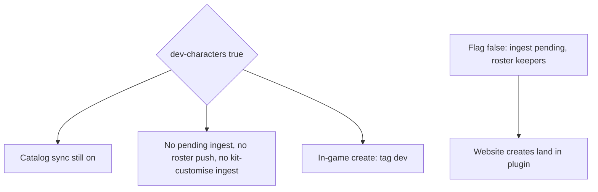

# Dev characters and realm wipes - lock

**Repos:** `rpcharacters` (owner), `ProvinceSystem` (website DB + plugin-key routes)

**Batch plan:** [01-batches.md](01-batches.md)

Player-facing strings: no em dash. Use `-` or `:`.

Pre-season: donors and helpers create on the website. Staff make throwaway characters **in-game**. While `dev-characters` is true, this server must **not** pull those website characters into the plugin. Catalog (stages / races / traits) still syncs. Staff tests must be deletable without touching donor submissions. Staff also need a nuclear wipe of **this realm's website character data**.

---

## Architecture lock

| Piece | Choice |
|-------|--------|
| Config | `dev-characters` boolean on `config.yml`. Default **false** in the jar. Pre-season / current playtest box sets **true**. |
| Flag true = isolate | No character sync from the site. Skip pending create pull/apply/**ack**. Skip kit-customise ingest. Skip **all** roster push. Catalog push stays on. |
| Flag false = live | Existing pending ingest + roster. Website characters appear in-game. |
| Tag when | Only `CharacterCreation` finish (`pd.addCharacter` path). Flag read at that moment. |
| Never ingest while true | `CharacterIngestService` returns immediately. Do not GET pending, do not POST applied. Creates stay `pending` on the site until a server with the flag **false** pulls them. |
| Persist | Character JSON key `dev: true`. Missing/false = not a dev character. Turning the config off does **not** untag existing rows. |
| Roster when flag false | Omit tagged characters. Full replace still runs; the pushed list is keepers only. |
| Tagged wipe | Hard delete files + list entries. Not permakill (`DEAD`). Scan `data/characterdata` like `MailRecipientDirectory`. |
| Website wipe | Plugin-key HTTP, realm from TFMCWeb gateway (same as pending/catalog). Deletes site tables for **this** `realm_id` only. |
| Confirm | `/rpcharacter wipe website` then `/rpcharacter wipe website confirm`. Same for `tagged`. 30s TTL, same sender. No bare `/rpcharacter confirm`. |
| Auth | Command: `rpcharacters.admin`. HTTP: `X-Plugin-Key` via `ProvinceSystemClient`. |
| Player meta | Website wipe does **not** clear `rpc_player_meta` / `character_player_meta` (ranks, 18+, slots). |

`web-creator.yml` `min-tier` is unrelated. Keep Noble lock on `main` until you open the season; do not fold that into this flag.

---

## Realm `main` on lobby / current playtest box

Website character rows are keyed by `realm_id`. Lobby + this game server both using `main` is **fine** for pre-season **if**:

1. This box keeps `dev-characters: true` so it never acks website creates (they stay pending for the real world).
2. You do **not** run `wipe website` on this box while it is still `main` unless you intend to delete **all** `main` site characters, including donor/helper pending creates.
3. Only one future live world with the flag **off** should ingest `main`. Two ingesting servers would race on pending ack.

`wipe tagged` is local plugin files. Safe anytime. `wipe website` follows **this server's** TFMCWeb `realm_id`. If that is `main`, it wipes the public `main` bucket.

Cleaner later: retag this playtest box as realm `dev`, keep lobby + real world as `main`. Then `wipe website` on the playtest box only deletes `dev`. Donor `main` pending is untouched. Until you do that, treat `wipe website` as nuclear for the season site.

---

## Commands (player-facing)

| Input | Effect |
|-------|--------|
| `/rpcharacter wipe website` | Admin. Prints realm + that a confirm is required. |
| `/rpcharacter wipe website confirm` | Admin + pending. Calls plugin-key realm wipe. |
| `/rpcharacter wipe tagged` | Admin. Prints count of tagged characters on disk. |
| `/rpcharacter wipe tagged confirm` | Admin + pending. Deletes tagged in-game characters. Then optional plugin-key delete of those ids on the site if they leaked. |

Usage / errors: `Usage: /rpcharacter wipe website confirm`. `Nothing to confirm.` `Confirm expired. Run the wipe command again.`

---

## Website wipe tables (`realm_id` = this server)

Delete:

- `character_roster`
- `character_creates`
- `character_wardrobe_slots`
- `character_create_wardrobe`
- `lore_item_customisations`

Do not delete player rank/age meta.

Website wipe does **not** delete `plugins/RPCharacters/data/**`. While the flag is true, roster push is off so local staff chars do not refill the site. After the flag is false, untagged in-game characters will reappear on the next roster push. After a site wipe, run `wipe tagged` if staff tests still exist locally.

---

## Tagged wipe (plugin)

For every owner UUID under `data/characterdata`:

1. Load player data (online `PlayerManager` or disk).
2. Remove characters with `dev == true`. Delete `<uuid>/<id>.json`.
3. If the active character was removed: clear active, `reevaluateFreeze`, kit/wardrobe/mail cleanup (`MailRecipientDirectory.remove`).
4. Save remaining. Roster push only if `dev-characters` is false (keepers only).
5. Collect deleted ids; plugin-key cleanup of site rows for those ids (best-effort, log warning on fail). Skip if flag is true (no site mirror).

---

## Out of scope

- Auto wipe on `onEnable` (same helper can be reused later).
- Backfill-tag of old untagged in-game characters.
- Gating in-game `/rpcharacter create` by donator rank.
- Changing `web-creator.yml` policy.
- Wiping other realms' site data.
