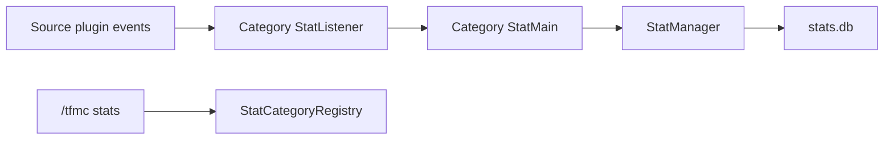

# TFMCCore stats hub

Centralized player and server stat tracking for TFMC plugins. TFMCCore owns storage, commands, and category registration. Source plugins expose domain facts via Bukkit events and never depend on TFMCCore.

## Hub role

| Component | Location |
|-----------|----------|
| `StatManager` | `net.tfminecraft.tfmccore.stats.StatManager` |
| SQLite database | `plugins/TFMCCore/stats.db` |
| Command | `/tfmc stats <category> [player]` |
| Global toggle | `plugins/TFMCCore/stats.yml` (`enabled: true`) |

Staff with `tfmccore.admin` can view other players' stats and server-wide totals.

**Stat key registry:** [STATS.md](STATS.md) lists every tracked stat key, trigger, and attributed player per category.

## Storage

- **Driver:** TLibs `SqliteDatabase` via `SqliteStatStorage`
- **Table:** `stat_totals (player_uuid, category, stat_key, value)`
- **Per-player rows:** default; each row is one player UUID + category + stat key
- **Server totals:** `SUM(value)` across all players for a category/stat key

Writes are async (`StatManager.increment` / `decrement` / `adjust`). Reads are synchronous.

Upsert uses `MAX(0, value + delta)` so counts cannot go negative.

## StatManager API

| Method | Use |
|--------|-----|
| `increment(uuid, category, statKey, delta)` | Positive delta only |
| `decrement(uuid, category, statKey, amount)` | Subtract; floors at 0 |
| `adjust(uuid, category, statKey, delta)` | Any non-zero delta |
| `getPlayerValue` / `getPlayerCategory` | Per-player reads |
| `getServerTotal` / `getServerCategoryTotals` | Staff aggregation |

Category code must call `StatManager` only. Never open JDBC or `stats.db` from category packages.

## Category package layout

Every stat category lives under `stats/categories/<categoryId>/`:

```
stats/categories/<categoryId>/
  <Name>StatConfig.java      # loads <categoryId>stats.yml
  <Name>StatMain.java        # maps events/logic to stat keys + player UUID
  <Name>StatListener.java    # Bukkit listener; delegates to Main
  <Name>StatQuery.java       # implements StatQuery for display labels
  <Name>StatCategory.java    # implements StatCategory; wires register()
```

### Class responsibilities

| Class | Role |
|-------|------|
| `StatConfig` | Load yaml labels and any key-mapping sections |
| `StatMain` | Pure logic: which UUID gets which stat key |
| `StatListener` | `@EventHandler(MONITOR, ignoreCancelled = true)` unless documented exception |
| `StatQuery` | `getLabel(statKey)` for `/tfmc stats` display |
| `StatCategory` | `getId()`, `register(plugin)` registers listener on TFMCCore |

Do not put new category code in `stats/vehicles/` or other legacy stub paths. Use `stats/categories/` only.

## Integration pattern



1. **Source plugin** fires Bukkit events when domain facts occur (create, kill, chat, etc.).
2. **TFMCCore** compiles against source JAR (`pom.xml` system scope) and lists `softdepend` in `plugin.yml`.
3. **Source plugin does not** add `depend` or `softdepend` on TFMCCore.
4. **TFMCCore.initStats()** registers the category only when the source plugin is loaded:

```java
if (getServer().getPluginManager().getPlugin("SourcePlugin") != null) {
    StatCategoryRegistry.register(new ExampleStatCategory(exampleStatConfig));
}
StatCategoryRegistry.registerAll(this);
```

Listeners register on the **TFMCCore** plugin instance, not on the source plugin.

## Configuration

| File | Purpose |
|------|---------|
| `stats.yml` | Global `enabled` flag |
| `<categoryId>stats.yml` | Per-category labels and mapping (e.g. `vehiclestats.yml`, `rpcharactersstats.yml`) |

Add new yaml files to `TFMCCore.createConfigs()` and `loadConfigs()`.

Typical yaml sections:

- `labels` - stat key to display string for `/tfmc stats`
- Optional mapping sections per category (e.g. vehicle groups, `class_labels`, `race_labels`)

Unknown stat keys fall back to `StatLabelFormatter.format(statKey)`.

## Stat key rules

- Use lowercase suffixes where ids are dynamic (`messages_rp`, `class_warrior`, `race_human`).
- Document per-category attribution (which player UUID owns each stat).
- Default: stats are per-player unless a category explicitly defines server-only keys.
- `characters_created` style counters: increment only, never decrement on related events.

## Reference implementations

| Category | Path | Source plugin |
|----------|------|---------------|
| `vehicles` | `stats/categories/vehicles/` | VehicleFramework (`VehicleRemoveEvent`) |
| `rpcharacters` | `stats/categories/rpcharacters/` | RPCharacters (lifecycle, permakill, chat events) |
| `advancedcrafting` | `stats/categories/advancedcrafting/` | AdvancedCrafting (alloy, item craft, smithing hit events) |
| `skills` | `stats/categories/skills/` | MythicLib `SkillCastEvent` (CAST/API triggers) |
| `factions` | `stats/categories/factions/` | SimpleFactions `BattleEndedEvent` (winner + participant roster) |

## Checklist: new category

1. **Source plugin (if needed):** fire Bukkit events for facts TFMCCore should count.
2. **TFMCCore pom.xml:** system dependency on source JAR for compile.
3. **plugin.yml:** add source plugin to `softdepend`.
4. **Package:** create `stats/categories/<id>/` with Config, Main, Listener, Query, Category.
5. **Resource:** `src/main/resources/<id>stats.yml` with labels.
6. **TFMCCore.java:** field for config, `loadConfigs()`, `createConfigs()`, conditional `StatCategoryRegistry.register` in `initStats()`.
7. **Test:** config load test mirroring `VehiclesStatConfigTest` or `RpCharactersStatConfigTest`.
8. **Build:** `mvn package` in `tfmccore/`.
9. **Manual:** `/tfmc stats <id>` for self and staff server totals.

## Registry and command

- `StatCategoryRegistry.register(category)` - add before `registerAll(plugin)`.
- `StatCategoryRegistry.registerAll(plugin)` - registers all listeners.
- `StatsCommand` resolves labels via `StatCategory.getQuery()`.
